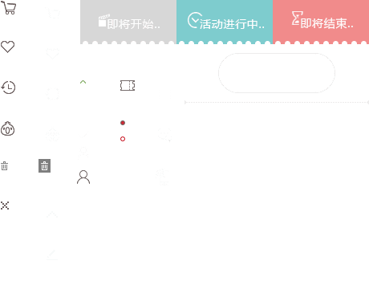
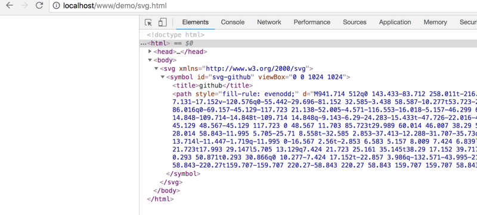
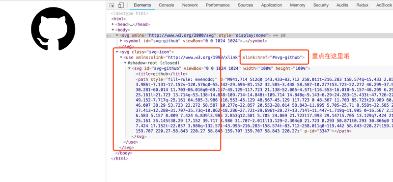
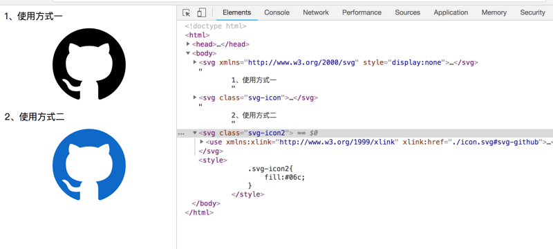
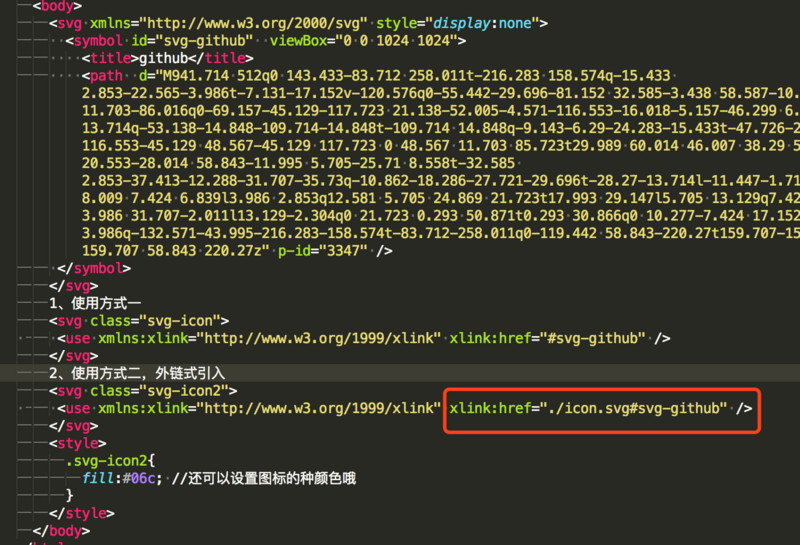

# 该如何以正确的姿势插入SVG Sprites？


## 前言

　　大家好，这里是[平头哥联盟](https://honeybadger8.github.io/blog/ "平头哥联盟")，我是`首席填坑官`——[苏南](https://github.com/meibin08 "首席填坑官")(South·Su)，今天要给大家分享的是`SVG  Sprites`(也叫雪碧图)，所谓雪碧图，当然就不是我们常喝的雪碧饮料（Sprites）哦，哈哈～

　　当下流程的移动端，手机型号太多太多，今天工作项目中突然发现还有同事在使用以前大家 曾经包括现在还很熟悉的`CSS` 图片精灵，被我们的测试MM找来说图片在iphone6、iphone plus、iphone x等大屏的手机全糊了，当时我就懵逼了，我说怎么会呢，后面一看，果然如此啊，看了下代码，原来是用的图片，我说为什么不用svg呢？？然后同事说一个一个的图标好麻烦，我说可以用svg sprite啊，～～＞﹏＜，这个时候轮到同事一脸懵逼了……，所以想着可能是不是同样还有很多同学也不知道`SVG symbols`呢，那么这就给大家分享一下：

## 正式开讲

　　SVG英文全称为( `Scalable Vector Graphics`)，意思为可缩放的矢量图形。它是基于XML（`Extensible Markup Language`），由World Wide Web Consortium（`W3C`）联盟进行开发的。严格来说应该是一种开放标准的矢量图形语言，可让你设计激动人心的、高分辨率的Web图形页面，SVG是一种采用XML 来描述二维图形的语言，**那么`symbol`元素是什么呢？**单纯翻译的话，是“符号”的意思，然我的理解是symbol元素用来定义一个图形模板对象，它可以用一个<use>元素实例化。symbol元素对图形的作用是在同一文档中多次使用，添加结构和语义，SVG是无论如何放大缩小都不会糊，而图片当展示的尺寸大于图片本身，就会糊了，糊了，糊了……

#### 1.1 回顾 Css Sprites 


```html
<div class="icon-sprite"></div>
```

```css
.icon-sprite {
    width: 45px;
    height: 45px;
    background-image: url(https://github.com/meibin08/img/sprite_icon.png);
    background-size: 100px 350px;
    background-position: 0 -60px;//**重点在于它**
    background-repeat: no-repeat;
}

```

　　在以前我们为了性能优化，多图标合在一张图上面，然后再使用css的 `background-position`来定位， 好处是减少了页面的加载，要命的问题是定位遇到兼容问题，1px、.5px偏差时，搞的你死去活来，后来移动端更是不清晰，被人骂了又骂。


#### 1.2 展望 Svg Sprites 

　　当后来有一天，在一个月黑风高、暴雨倾盆、雷电交加的夜晚，我独自一人漫步在一片小树林里，后来我发现了新大陆————`SVG`，当然如果仅仅svg就我也就不会拿出来吹水，因为肯定是会被人喷的一脸口水的，但是如果再加上它的小弟——`symbols`？ SVG symbols、**SVG symbols**、SVG symbols **重要的事说三遍不过份吧**，双重组合（屠龙、倚天）试问天下谁敢它争锋？特别是`SVG`它还下面还有很多小弟哦～，……有点扯远了；这项技术基于两个元素的使用：`<symbol>`和`<use>`。

+ 从ps或者`Illustrator`创建并导出SVG图标，源码大概是这样的：

```
<svg xmlns="http://www.w3.org/2000/svg" xmlns:xlink="http://www.w3.org/1999/xlink" viewBox="0 0 1024 1024"> 
    <path style="fill-rule: evenodd;" d="M941.714 512q0 143.433-83.712 258.011t-216.283 158.574q-15.433 2.853-22.565-3.986t-7.131-17.152v-120.576q0-55.442-29.696-81.152 32.585-3.438 58.587-10.277t53.723-22.272 46.299-37.998 30.281-60.014 11.703-86.016q0-69.157-45.129-117.723 21.138-52.005-4.571-116.553-16.018-5.157-46.299 6.29t-52.553 25.161l-21.723 13.714q-53.138-14.848-109.714-14.848t-109.714 14.848q-9.143-6.29-24.283-15.433t-47.726-22.016-49.152-7.717q-25.161 64.585-3.986 116.553-45.129 48.567-45.129 117.723 0 48.567 11.703 85.723t29.989 60.014 46.007 38.29 53.723 22.272 58.587 10.277q-22.857 20.553-28.014 58.843-11.995 5.705-25.71 8.558t-32.585 2.853-37.413-12.288-31.707-35.73q-10.862-18.286-27.721-29.696t-28.27-13.714l-11.447-1.719q-11.995 0-16.567 2.56t-2.853 6.583 5.157 8.009 7.424 6.839l3.986 2.853q12.581 5.705 24.869 21.723t17.993 29.147l5.705 13.129q7.424 21.723 25.161 35.145t38.29 17.152 39.717 3.986 31.707-2.011l13.129-2.304q0 21.723 0.293 50.871t0.293 30.866q0 10.277-7.424 17.152t-22.857 3.986q-132.571-43.995-216.283-158.574t-83.712-258.011q0-119.442 58.843-220.27t159.707-159.707 220.27-58.843 220.27 58.843 159.707 159.707 58.843 220.27z" p-id="3347" />
</svg>

```

+ 重点来了，那么我们用`symbols`包装后是这个样子的：

```
<svg xmlns="http://www.w3.org/2000/svg">
  <symbol id="svg-github"  viewBox="0 0 1024 1024">
    <title>github</title>
    <path style="fill-rule: evenodd;" d="M941.714 512q0 143.433-83.712 258.011t-216.283 158.574q-15.433 2.853-22.565-3.986t-7.131-17.152v-120.576q0-55.442-29.696-81.152 32.585-3.438 58.587-10.277t53.723-22.272 46.299-37.998 30.281-60.014 11.703-86.016q0-69.157-45.129-117.723 21.138-52.005-4.571-116.553-16.018-5.157-46.299 6.29t-52.553 25.161l-21.723 13.714q-53.138-14.848-109.714-14.848t-109.714 14.848q-9.143-6.29-24.283-15.433t-47.726-22.016-49.152-7.717q-25.161 64.585-3.986 116.553-45.129 48.567-45.129 117.723 0 48.567 11.703 85.723t29.989 60.014 46.007 38.29 53.723 22.272 58.587 10.277q-22.857 20.553-28.014 58.843-11.995 5.705-25.71 8.558t-32.585 2.853-37.413-12.288-31.707-35.73q-10.862-18.286-27.721-29.696t-28.27-13.714l-11.447-1.719q-11.995 0-16.567 2.56t-2.853 6.583 5.157 8.009 7.424 6.839l3.986 2.853q12.581 5.705 24.869 21.723t17.993 29.147l5.705 13.129q7.424 21.723 25.161 35.145t38.29 17.152 39.717 3.986 31.707-2.011l13.129-2.304q0 21.723 0.293 50.871t0.293 30.866q0 10.277-7.424 17.152t-22.857 3.986q-132.571-43.995-216.283-158.574t-83.712-258.011q0-119.442 58.843-220.27t159.707-159.707 220.27-58.843 220.27 58.843 159.707 159.707 58.843 220.27z" p-id="3347" />
 </symbol>
</svg>

```

+ 乍一看，感觉没有变化啊，长一样是不是？:smile:，细看多了个`symbol`包裹了一下，嗯，也就这点区别了～。那么问题又来了，我们直接在页面上引用，就完事了吗？结果是否定的，请下图：

```
<body>
    <svg xmlns="http://www.w3.org/2000/svg">
      <symbol id="svg-github"  viewBox="0 0 1024 1024">
        <title>github</title>
        <path style="fill-rule: evenodd;" d="M941.714 512q0 143.433-83.712 258.011t-216.283 158.574q-15.433 2.853-22.565-3.986t-7.131-17.152v-120.576q0-55.442-29.696-81.152 32.585-3.438 58.587-10.277t53.723-22.272 46.299-37.998 30.281-60.014 11.703-86.016q0-69.157-45.129-117.723 21.138-52.005-4.571-116.553-16.018-5.157-46.299 6.29t-52.553 25.161l-21.723 13.714q-53.138-14.848-109.714-14.848t-109.714 14.848q-9.143-6.29-24.283-15.433t-47.726-22.016-49.152-7.717q-25.161 64.585-3.986 116.553-45.129 48.567-45.129 117.723 0 48.567 11.703 85.723t29.989 60.014 46.007 38.29 53.723 22.272 58.587 10.277q-22.857 20.553-28.014 58.843-11.995 5.705-25.71 8.558t-32.585 2.853-37.413-12.288-31.707-35.73q-10.862-18.286-27.721-29.696t-28.27-13.714l-11.447-1.719q-11.995 0-16.567 2.56t-2.853 6.583 5.157 8.009 7.424 6.839l3.986 2.853q12.581 5.705 24.869 21.723t17.993 29.147l5.705 13.129q7.424 21.723 25.161 35.145t38.29 17.152 39.717 3.986 31.707-2.011l13.129-2.304q0 21.723 0.293 50.871t0.293 30.866q0 10.277-7.424 17.152t-22.857 3.986q-132.571-43.995-216.283-158.574t-83.712-258.011q0-119.442 58.843-220.27t159.707-159.707 220.27-58.843 220.27 58.843 159.707 159.707 58.843 220.27z" p-id="3347" />
     </symbol>
    </svg>
</body>

```



+ 那么该如何摆正姿势(`你随意就好`)，正确的使用它呢？热爱学习的你，是不是已经有些饥渴难耐了呢？马上为你送上高潮部分：




```
<body>
    <svg xmlns="http://www.w3.org/2000/svg" style="display:none">
      <symbol id="svg-github"  viewBox="0 0 1024 1024">
        <title>github</title>
        <path  d="M941.714 512q0 143.433-83.712 258.011t-216.283 158.574q-15.433 2.853-22.565-3.986t-7.131-17.152v-120.576q0-55.442-29.696-81.152 32.585-3.438 58.587-10.277t53.723-22.272 46.299-37.998 30.281-60.014 11.703-86.016q0-69.157-45.129-117.723 21.138-52.005-4.571-116.553-16.018-5.157-46.299 6.29t-52.553 25.161l-21.723 13.714q-53.138-14.848-109.714-14.848t-109.714 14.848q-9.143-6.29-24.283-15.433t-47.726-22.016-49.152-7.717q-25.161 64.585-3.986 116.553-45.129 48.567-45.129 117.723 0 48.567 11.703 85.723t29.989 60.014 46.007 38.29 53.723 22.272 58.587 10.277q-22.857 20.553-28.014 58.843-11.995 5.705-25.71 8.558t-32.585 2.853-37.413-12.288-31.707-35.73q-10.862-18.286-27.721-29.696t-28.27-13.714l-11.447-1.719q-11.995 0-16.567 2.56t-2.853 6.583 5.157 8.009 7.424 6.839l3.986 2.853q12.581 5.705 24.869 21.723t17.993 29.147l5.705 13.129q7.424 21.723 25.161 35.145t38.29 17.152 39.717 3.986 31.707-2.011l13.129-2.304q0 21.723 0.293 50.871t0.293 30.866q0 10.277-7.424 17.152t-22.857 3.986q-132.571-43.995-216.283-158.574t-83.712-258.011q0-119.442 58.843-220.27t159.707-159.707 220.27-58.843 220.27 58.843 159.707 159.707 58.843 220.27z" p-id="3347" />
     </symbol>
    </svg>
    1、使用方式一
    <svg class="svg-icon">
         <use xmlns:xlink="http://www.w3.org/1999/xlink" xlink:href="#svg-github" />
    </svg>
    2、使用方式二，外链式引入
    <svg class="svg-icon2">
         <use xmlns:xlink="http://www.w3.org/1999/xlink" xlink:href="./icon.svg#svg-github" />
    </svg>
    <style>
        .svg-icon2{
            fill:#06c; //还可以设置图标的种颜色哦
        }
    </style>
</body>

```

　　可能大家就有点疑惑了，为什么这样引入图标会显示呢？因为要显示图标，我们还需要使用<use>元素，通俗的讲就是你定义了一组图形对象（使用`<symbol>`元素）之后，可以使用<use>元素来对它进行无限次实例化展示。你使用xlink:href属性来指定你想要展示哪一组图标（相当于css图片精灵中的background-position），这里，我们要展示的是id为#svg-github的<symbol>，细心的宝宝们可能还发现了style="display:none",你可以把它理解为是css sprite里的图片base64转化后的文件，先声明了变量存放起来了，，而方法二里的xlink:href="./icon.svg#svg-github"，可以理解为是Css Sprites里我们background-image 引入图片一样，而 #svg-github 就是background-position里的坐标，还有颜色的改变，我们可以直接在svg内的 `path`上写行内式 fill="#06c"、style="fill:#06c";都是可以的，在维护上，是不是比图片更加方便呢？？？

　　当然啦，大家都懂的，越漂亮的妹子追的人越多啦，代码也一样，越好用的东西往往也是不可能那么完美啦，看到这里，是不是觉得想骂娘呢？白看你说这么多废话，最后不能用，坑爹…… 
　　别慌，其实也没有那么糟糕啦 ，**SVG只在IE9以上支持；所以如果你需要支持`IE8`及以下的浏览器**，你需要另外再写一套降级（例如，使用png图片方案），随着科技的发展，`IE9`以上大多数人还是能接受啦，特别是手机端的用户，再也不用担心测试MM来找你，图标不清晰的问题了啦，是不是很开心，有没有～～

## 总结：
Svg Sprites相比Css Sprites，不管是在维护和开发的过程中，还是在用户体验、性能、大小、
项目迭代代码维护上都比Css Sprites方便，更高效便捷; 
>svg sprites优缺点：

+ `Svg Sprites`使用xlink:href #id的方式获取，便于维护和扩展，因为小图的id不会随便改动; 
+ 方便改变图片颜色，通过设置fill:颜色值，随意改变小图颜色; 
+ IE9以上支持。

>Css Sprites优缺点：

+ Css Sprites使用background-position不便于维护和扩展、定位不精确等问题，例如：在后期项目迭代中我们需要删除其中一个小图，那么排在它后面的小图位置都要移动，需要再次修改csss样式，或每次都要打开PS删除某图标再导出;
+ 无法修改小图颜色，要UI设计师调整后替换，过程漫长效率低;
+ 在移动端的大屏手机图标会模糊，影响体验。


　　以上就是今天的分享，写了蛮久，最近才在开始尝试写博客，新手上路中，文章中有不对之处，烦请各位大神斧正。如果你觉得这篇文章对你有所帮助，请记得点赞哦～，想了解更多？[请猛戳这里！](https://github.com/meibin08/)


> 作者：苏南 - [首席填坑官](https://github.com/meibin08/ "首席填坑官")
>
> 来源：[平头哥联盟](https://honeybadger8.github.io/blog/ "平头哥联盟")
>
> 交流群：912594095[`资源获取/交流群`]、386485473(前端) 、260282062(测试)
>
> 本文原创，著作权归作者所有。商业转载请联系`平头哥联盟`获得授权，非商业转载请注明出处。 


