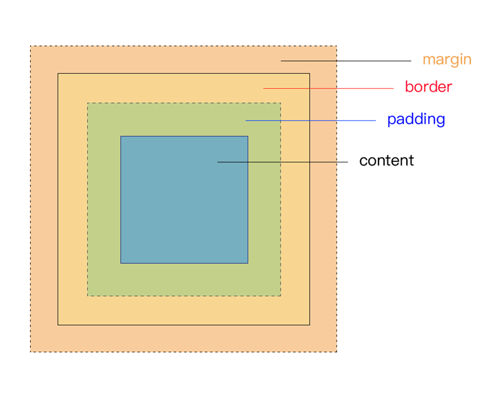
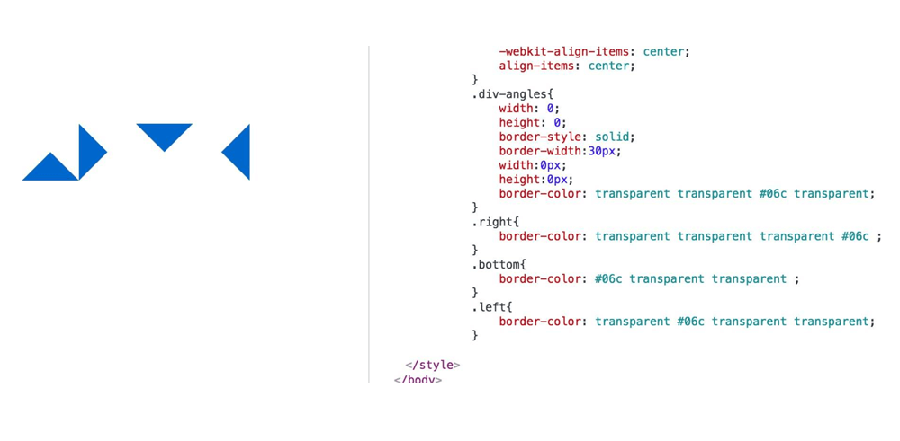

# 那些年你踩过的坑，都在这里了～


## 前言

　　前段时间面试(包括[阿里巴巴](https://segmentfault.com/u/susouth/articles "阿里巴巴")的电话面试)，遇到过一些面试题，且面试中出现机率较高的提问/笔试，有些答的不是很好挂掉了，今天终于有时间整理出来分享给大家，希望对大家面试有所帮助，都能轻松拿offer。

!> 主要分三部分：`html`、`css`、`js`；react/vue等都归类于js,内容来源于`面试过程中遇到的`、在复习过程中看到认为值得`加深巩固`、`群友交流分享`的；如有理解的错误或不足之处，欢迎留言纠错、斧正，这里是[平头哥联盟](https://honeybadger8.github.io/blog/ "平头哥联盟")，我是`首席填坑官`∙[苏南](https://github.com/meibin08 "首席填坑官")(South·Su) ^_^～


## HTML

##### 1、什么是盒子模型？
　　有些面试官会问你对盒子模型的理解，在我们平时看到的网页中，内部的每一个标签元素它都是有几个部分构成的：内容(content)、外边距(margin)、内边距(padding)、边框(border)，四个部分组成，当你说完这些面试官是不会满意这个答案的，因为还有一个重点（[IE盒模型和标准盒模型](https://juejin.im/user/597de6e0f265da3e3c5f6d7d/posts "IE盒模型和标准盒模型")的区别）———IE盒模型的content包括border、padding



##### 2、页面导入样式时有几种方法，它们之间有区别？
+ `link`标签引入，也是当下用的最多的一种方式，它属于XHTML标签，除了能加载css外，还能定义rel、type、[media](https://segmentfault.com/u/susouth/articles "media")等属性;
+ `@import`引入，@import是CSS提供的，只能用于加载CSS;
+ `style` 嵌入方式引入，减少页面请求(优点)，但只会对当前页面有效，无法复用、会导致代码冗余，不利于项目维护(缺点)，此方式一般只会项目主站首页使用（腾讯、淘宝、网易、搜狐）等大型网站主页，之前有看到过都是这种方式，但后来有些也舍弃了  
>**小结**：`link`页面被加载的时，link会同时被加载，而`@import`引用的CSS会等到页面被加载完再加载,且link是`XHTML`标签，无兼容问题; link支持动态js去控制DOM节点去改变样式，而@import不支持，

##### 3、简单讲述一下块元素、内联元素、空元素有哪些，它们之间的区别？
+ 行内元素有：a、b、span、img、input、select、textarea、em、img、strong（强调的语气）;
+ 块级元素有：ul、ol、li、dl、dt、dd、h1、h2、h3、h4…p、section、div、form等;
+ 空元素： input type="hidden"/>、br>、hr>、link>、meta>;  

>**小结**：块元素总是独占一行，margin对内联元素上下不起作用; 

##### 4、说说 cookies，sessionStorage 、 localStorage 你对它们的理解？
+ cookie是网站为了标示用户身份而储存在用户本地终端上的数据（通常经过加密），cookie数据始终在同源的http请求中携带，记会在浏览器和服务器间来回传递。 
+ sessionStorage和localStorage不会自动把数据发给服务器，仅在本地保存。
+ 大小： cookie数据大小不能超过4k,sessionStorage和localStorage 虽然也有存储大小的限制，但比cookie大得多，可以达到5M或更大。
+ 时效：`localStorage` 存储持久数据，浏览器关闭后数据不丢失除非用户主动删除数据或清除浏览器/应用缓存；`sessionStorage`  数据在当前浏览器窗口关闭后自动删除。
+ `cookie` 设置的cookie过期时间之前一直有效，即使窗口或浏览器关闭部分面试官可能还会再深入一些：

>1)、如何让cookie浏览器关闭就失效？——不对cookie设置任何正、负或0时间的即可;

>2)、sessionStorage在浏览器多窗口之间 (同域)数据是否互通共享? ——不会，都是独立的，localStorage会共享;

>3)、能让localStorage也跟cookie一样设置过期时间？答案是可以的，在存储数据时，也存储一个时间戳，get数据之前，先拿当前时间跟你之前存储的时间戳做比较 详细可看我之前写的另一篇分享（[小程序项目总结](https://segmentfault.com/a/1190000016492161 "小程序项目总结") ）。

##### 5、简述一下你对HTML语义化的理解 ？
　　语义化是指根据内容的类型，选择合适的标签（代码语义化）,即用正确的标签做正确的事情; `html`语义化让页面的内容结构化，结构更清晰，有助于浏览器、[搜索引擎](https://segmentfault.com/a/1190000016492161 "搜索引擎")解析对内容的抓取; 语义化的HTML在没有`CSS`的情况下也能呈现较好的内容结构与代码结构; 搜索引擎的爬虫也依赖于HTML标记来确定上下文和各个关键字的权重，利于`SEO`;


## CSS

##### 1、position的static、relative、absolute、fixed它们的区别？
+ `absolute`：绝对定位，元素会相对于值不为 static 的第一个父元素进行定位(会一直往父级节点查找)，且它是脱离正常文档流、不占位的;
+ `fixed`:同样是绝对定位，但元素会相对于浏览器窗口进行定位，而不是父节点的position (IE9以下不支持);
+ `relative`:相对定位，元素相对于自身正常位置进行定位,属于正常文档流;static: position的默认值，也就是没有定位，当元素设置该属性后（ top、bottom、left、right、z-index ）等属性将失效; 
+ `inherit`:貌似没用过，查了一下文档“规定从父元素继承 position 属性的值”;

##### 2、如何让一个元素垂直/水平（垂直水平）都居中，请列出你能想到的几种方式？
+ 水平垂直居中 —— 方式一
```
<div class="div-demo"></div>
<style>
	.div-demo{
		width:100px;
		height:100px;
		background-color:#06c;
		margin: auto;
		position:absolute;
		top: 0;
		left: 0;
		bottom: 0;
		right: 0;
	}
</style>
```

+ 水平垂直居中 —— 方式二

```
<style>
	.div-demo{
		width:100px;
		height:100px;
		background-color:#06c;
		margin: auto;
		position:absolute;
		top: 50%;
		left: 50%;
		transform: translate(-50%,-50%);
		-webkit-transform: translate(-50%,-50%);
	}
</style>
```

+ 水平垂直居中 —— 方式三，（新旧伸缩盒兼容）

```
<body class="container">
	<div class="div-demo"></div>
	<style>

		html,body{
			height:100%;
		}
		.container{
			display: box;
			display: -webkit-box;
			display: flex;
			display: -webkit-flex;
			-webkit-box-pack: center;
			-webkit-justify-content: center;
			justify-content: center;
			-webkit-box-align: center;
			-webkit-align-items: center;
			align-items: center;
		}
		.div-demo{
			width:100px;
			height:100px;
			background-color:#06c;
		}
	</style>

</body>

```

##### 3、项目中有用纯CSS样式写过 三角形icon吗？
```html
<body class="container">
	<div class="div-angles"></div>
	<div class="div-angles right"></div>
	<div class="div-angles bottom"></div>
	<div class="div-angles left"></div>
	<style>

		html,body{
			height:100%;
		}
		.container{
			display: box;
			display: -webkit-box;
			display: flex;
			display: -webkit-flex;
			-webkit-box-pack: center;
			-webkit-justify-content: center;
			justify-content: center;
			-webkit-box-align: center;
			-webkit-align-items: center;
			align-items: center;
		}
		.div-angles{
			width: 0;
			height: 0;
			border-style: solid;
			border-width:30px;
			width:0px;
			height:0px;
			border-color: transparent transparent #06c transparent;
		}
		.right{
			border-color: transparent transparent transparent #06c ;
		}
		.bottom{
			border-color: #06c transparent transparent ;
		}
		.left{
			border-color: transparent #06c transparent transparent;
		}
	</style>

</body>

```



##### 4、什么是外边距合并,项目中是否有遇到过?
+ 有，外边距合并指的是，当两个垂直元素的都设置有margin外边距相遇时，它们将形成一个外边距。 合并后的外边距的高度等于两个发生合并的外边距的值中的较大那个。

##### 5、:before 和 :after两伪元素，平时都是使用双冒号还是单冒号？有什么区别？以及它们的作用：
+ 单冒号(:)用于[CSS3伪类](https://www.toutiao.com/i6606779850801807885/ "CSS3伪类")，双冒号(::)用于CSS3伪元素。（伪元素由双冒号和伪元素名称组成） ;
+ 双冒号是在当前规范中引入的，用于区分伪类和伪元素。不过浏览器需要同时支持旧的已经存在的伪元素写法，比如:first-line、:first-letter、:before、:after等，
而新的在CSS3中引入的伪元素则不允许再支持旧的单冒号的写法;
+ 想让插入的内容出现在其它内容前，使用`::before`，之后则使用::after； 在代码顺序上，`::after`生成的内容也比::before生成的内容靠后。
如果按堆栈视角，::after生成的内容会在::before生成的内容之上; 

##### 6、Chrome、Safari等浏览器，当表单提交用户选择记住密码后，下次自动填充表单的背景变成黄色，影响了视觉体验是否可以修改？
```css
input:-webkit-autofill, textarea:-webkit-autofill, select:-webkit-autofill {
  background-color: #fff;//设置成元素原本的颜色
  background-image: none;
  color: rgb(0, 0, 0);
}
//方法2：由(licongwen )补充
input:-webkit-autofill {
    -webkit-box-shadow: 0px 0 3px 100px #ccc inset; //背景色
}
```

##### 7、浏览器的最小字体为12px，如果还想再小，该怎么做？
+ 用图片：如果是展示的内容基本是固定不变的话，可以直接切图兼容性也完美(不到万不得已，不建议);
+ 找UI设计师沟通：为了兼容各大主流浏览器，避免后期设计师来找你撕逼，主动找TA沟通，讲明原因 ————注意语气，好好说话不要激动，更不能携刀相逼;
+ CSS3：css3的样式transform: scale(0.7)，scale有缩放功能;
+ 又去找[chrome](https://www.toutiao.com/i6606779850801807885/ "chrome")复习了一下，说是 “display:table;display: table-cell;” 可以做到，没用过。
##### 8、移动端的边框0.5px,你有几种方式实现？
+ devicePixelRatio:它是window对象中有一个devicePixelRatio属性，设备物理像素和设备独立像素的比例，也就是 devicePixelRatio = 物理像素 / 独立像素;这种方式好麻烦，js检测，再给元素添加类名控制，难维护;
+ 切图：直接.5px的切图，这种方式太low，建议还是别用了，特别难维护，高清屏就糊了,更重要的是被同行看到会觉得你们很渣渣～;
+ image背景：css3的background-image:`linear-gradient`，缺点就是：样式多，遇到圆角这个方案就杯剧了; box-shadow:网上看到说使用box-shadow模拟边框，box-shadow: inset 0px -1px 1px -1px #06c;没用过，不过多评论，建议自己百度;
+ 伪类缩放：现在用的比较多的方式之一 :after 1px然后transform: scale(0.5);基本能满足所有场景，对于圆角的处理也很方便;
>贴上3、5两方案代码，也是目前公司一直在用的([预处理SCSS](https://segmentfault.com/u/susouth/articles "预处理SCSS"))：

```css
//3、css3的background-image 本文由平头哥联盟-首席填坑官∙苏南分享
@mixin border($top:1, $right:1, $bottom:1, $left:1, $color:#ebebf0) {
  background-image:linear-gradient(180deg, $color, $color 50%, transparent 50%), 
                  linear-gradient(90deg, $color, $color 50%, transparent 50%), 
                  linear-gradient(0deg, $color, $color 50%, transparent 50%),
                  linear-gradient(90deg, $color, $color 50%, transparent 50%);
  background-size: 100% $top + px, $right + px 100%, 100% $bottom + px, $left + px 100%;
  background-repeat: no-repeat;
  background-position: top, right top, bottom, left top ;
}

@mixin borderTop($top:1, $color:#ebebf0) {
  @include border($top, 0, 0, 0, $color);
}
@mixin borderRight($right:1, $color:#ebebf0) {
  @include border(0, $right, 0, 0, $color);
}
@mixin borderBottom($bottom:1, $color:#ebebf0) {
  @include border(0, 0, $bottom, 0, $color);
}
@mixin borderLeft($left:1, $color:#ebebf0) {
  @include border(0, 0, 0, $left, $color);
}
@mixin borderColor($color:#ebebf0) {
  @include border(1, 1, 1, 1, $color);
}

//5、css3的transform:scale  本文由平头哥联盟-首席填坑官∙苏南分享
@mixin borderRadius($width:1,$style:solid,$color:#ebebf0,$radius:2px) {
  position:relative;
    &:after{
       left:0px;
       top:0px;
       right:-100%;
       bottom:-100%;
       border-radius:$radius;
       border-style: $style;
       border-color: $color;
       border-width: $width+ px;
       position:absolute;
       display:block;
       transform:scale(0.5);
       -webkit-transform:scale(0.5);
       transform-origin:0 0;
       -webkit-transform-origin:0 0;
       content:'';
    }
}
```

##### 8、display:none与visibility:hidden两者的区别？
+ display:none在页面中是不占位置的，而visibility:hidden保留原来的位置后;
+ display：none显示/隐藏 页面会产生回流和重绘的问题，visibility则不会 ——`重绘/回流请看JS部分第七题`;

##### 9、CSS样式优先级排序如何计算的？

+ 同权重: 内联样式表（标签内部）> 嵌入样式表（当前文件中）> 外部样式表（外部文件中）。
+ !important >  id > class > tag
+ important 比 内联优先级高

##### 10、li与li之间有看不见的空白间隔是什么原因引起的？你是怎么解决的？
+ 行框的排列会受到中间空白（回车\空格）等的影响，因为空格也属于字符,这些空白也会被应用样式，占据空间，所以会有间隔，把字符大小设为0，就没有空格了。


## Javascript
##### 1、请将下列b函数进行修改，保证每次调用a都能+1（考闭包）:

```javascript
//本文由平头哥联盟-首席填坑官∙苏南分享,如有错误，欢迎留言
function b(){
	var a=1;
};

function b(){
	var a=1;
	return ()=>{
		a++;
		return a;
	}
};
let c = b();
c(); //2
c(); //3
c(); //4
```


####### 2、js有哪些基本数据类型：   
ECMAScript 标准定义有7种数据类型：  
+ `Boolean`
+ `Null`
+ `Undefined`
+ `Number`
+ `String`
+ `Symbol` :（[ECMAScript 6](https://www.toutiao.com/i6606779850801807885/ "ECMAScript 6") 新定义 ，Symbol 生成一个全局唯一、表示独一无二的值） 
+ `Object` :（Array、Function、Object）

##### 3、用js将 386485473.88 转换为 386,485,473.88（千位分割符）：
```javascript
//方法1:
var separator=(num)=>{
	if(!num){
		return '0.00';
	};
	let str = parseFloat(num).toFixed(2);
	return str && str
		.toString()
		.replace(/(\d)(?=(\d{3})+\.)/g, function($0, $1) {
			return $1 + ",";
		});
}

separator(386485473.88) //"386,485,473.88"

//方法2：
(386485473.88).toLocaleString('en-US')  // "386,485,473.88" 由 (sRect)补充

```

##### 4、js的 for 跟for in 循环它们之间的区别？

+ 遍历数组时的异同： `for`循环 数组下标的typeof类型:`number`, for in 循环数组下标的typeof类型:`string`;

```javascript
var southSu = ['苏南','深圳','18','男'];
for(var i=0;i<southSu.length;i++){
	console.log(typeof i); //number
	console.log(southSu[i]);// 苏南 , 深圳 , 18 , 男
}
var arr = ['苏南','深圳','18','男','帅气',"平头哥联盟-首席填坑官"];
for(var k in arr){
	console.log(typeof k);//string
	console.log(arr[k]);// 苏南 , 深圳 , 18 , 男 , 帅气,平头哥联盟-首席填坑官
}

```

+ 遍历对象时的异同：`for`循环 无法用于循环对象，获取不到obj.length; for in 循环遍历对象的属性时，原型链上的所有属性都将被访问，解决方案：使用`hasOwnProperty`方法过滤或Object.keys会返回自身可枚举属性组成的数组 

```javascript 
Object.prototype.test = '原型链上的属性,本文由平头哥联盟-首席填坑官∙苏南分享';
var southSu = {name:'苏南',address:'深圳',age:18,sex:'男',height:176};
for(var i=0;i<southSu.length;i++){
	console.log(typeof i); //空
	console.log(southSu[i]);//空
}


for(var k in southSu){
	console.log(typeof k);//string
	console.log(southSu[k]);// 苏南 , 深圳 , 18 , 男 , 176 ,本文由平头哥联盟-首席填坑官∙苏南分享
}

```

##### 5、给table表格中的每个td绑定事件，td数量为1000+，写一下你的思路(事件委托题)：

```html
<body class="container">
	<table id="table">
		<tr><td>我们是平头哥联盟</td><td>，我是首席填坑官</td><td>苏南</td><td>前端开发</td><td>优秀</td></tr>
		<tr><td>我们是平头哥联盟</td><td>，我是首席填坑官</td><td>苏南</td><td>前端开发</td><td>优秀</td></tr>
		<tr><td>我们是平头哥联盟</td><td>，我是首席填坑官</td><td>苏南</td><td>前端开发</td><td>优秀</td></tr>
		…………
	</table>
<script>
	let table =document.querySelector("#table");
	table.addEventListener("click",(e)=>{
		let {nodeName} = e.target;
		if(nodeName.toUpperCase() === "TD"){
			console.log(e.target);//<td>N</td>
		}
	},false);

</script>
</body>

```

##### 6、js把一串字符串去重(能统计出字符重复次数更佳)，列出你的思路（两种以上）：

```javascript
<script>
	let str = "12qwe345671dsfa233dsf9876ds243dsaljhkjfzxcxzvdsf本文由平头哥联盟-首席填坑官∙苏南分享";
	let array = str.split("");

	//方案一：
	array = [...new Set(array)].join("");
	array = ((a)=>[...new Set(a)])(array).join("");
	console.log(array);//12qwe34567dsfa98ljhkzxcv本文由平头哥联盟-首席填坑官∙苏南分享  只能过滤，不会统计

	//方案二：
	function unique (arr) {
		const seen = new Map()
		return (arr.filter((a) => !seen.has(a) && seen.set(a, 1))).join("");
	}
	console.log(unique(array)) // 12qwe34567dsfa98ljhkzxcv本文由平头哥联盟-首席填坑官∙苏南分享

	//方案三：
	function unique (arr) {
		let arrs=[];
		var news_arr = arr.sort();//排序能减少一次循环
		for(var i=0;i<news_arr.length;i++){
				if(news_arr[i] == news_arr[i+1] && news_arr[i]!= news_arr[i-1] ){
						arrs.push(arr[i]);
				};
 
		};
		return arrs.join("");
	}
	console.log(unique(array)) // 12qwe34567dsfa98ljhkzxcv本文由平头哥联盟-首席填坑官∙苏南分享

	//方案四：
	function unique (arr) {
		let obj={};
		for(var i=0;i<arr.length;i++){
			let key = arr[i];
			if(!obj[key] ){
					obj[key]=1;
			}else{
				obj[key]+=1;
			}
 
		};
		return obj;
	}
	console.log(unique(array)) // object 对应每个key以及它重复的次数 

</script>

```
##### 7、项目上线前，你们做过哪些性能优化：

+ 图片预加载，css样式表放在顶部且link链式引入，javascript放在底部body结束标签前;
+ 使用dns-prefetch对项目中用到的域名进行 DNS 预解析，减少 DNS 查询，如： <link rel="dns-prefetch" href="//github.com"/>; 
+ 减少http请求次数:图片静态资源使用CDN托管;
+ API接口数据设置缓存，CSS Sprites/SVG Sprites(如有疑惑：[该如何以正确的姿势插入SVG Sprites?](https://segmentfault.com/a/1190000016476981 "该如何以正确的姿势插入SVG Sprites?") 这篇说的很详细), JS、CSS源码压缩、图片大小控制合适，使用iconfont(+ 字体图标)或SVG，它们比图片更小更清晰，网页Gzip压缩;
+ 减少DOM操作次数，优化javascript性能;
+ 减少 DOM 元素数量，合理利用:after、:before等伪类;
+ 避免重定向、图片懒加载;前后端分离开发，资源按需加载，最好能做到首屏直出(即[服务端渲染](https://github.com/meibin08/NeteaseCloudMusic-SSR "服务端渲染")); 
+ 避免使用CSS Expression（css表达式)又称Dynamic properties(动态属性) ;
+ 多域名分发划分内容到不同域名，解决浏览器域名请求并发数问题，同时也解决了请求默认携带的cookie问题;
+ 尽量减少 iframe 使用，它会阻塞主页面的渲染; 对所有资源压缩 JavaScript 、 CSS 、字体、图片等，甚至html;
+ 只想到这些，欢迎补充……

##### 8、你对重绘、重排的理解？
+ 首先网页数次渲染生成时，这个可称为重排; 
+ 修改DOM、样式表、用户事件或行为（鼠标悬停、页面滚动、输入框键入文字、改变窗口大小等等）这些都会导致页面重新渲染，那么重新渲染，就需要重新生成布局和重新绘制节点，前者叫做"重排"，后者"重绘"; 
+ 减少或集中对页面的操作，即多次操作集中在一起执行; 
+ 总之可以简单总结为：重绘不一定会重排，但重排必然为会重绘。 
+ 更详细的可以看[阮老师分析](http://www.ruanyifeng.com/blog/2015/09/web-page-performance-in-depth.html "阮老师分析")

##### 8、有用过`promise`吗？请写出下列代码的执行结果，并写出你的理解思路：

```javascript
setTimeout(()=>{
		console.log(1);
}, 0);

new Promise((resolve)=>{
		console.log(2);
		for(var i = 1; i < 200; i++){
				i = 198 && resolve();
		}
		console.log(3);
}).then(()=>{
		console.log(4);
});
console.log(5);

// 结果：2、3、5、4、1;
```
+ 首先要讲一下，js是单线程执行，那么代码的执行就有先后; 
+ 有先后，那就要有规则(排队)，不然就乱套了，那么如何分先后呢？大体分两种：同步、异步; 
+ 同步很好理解，就不用多说了(我就是老大,你们都要给我让路); 
+ 异步(定时器[setTimeout ，setInterval]、事件、ajax、promise等)，说到异步又要细分宏任务、微任务两种机制，  
+ `宏任务`：js异步执行过程中遇到宏任务，就先执行宏任务，将宏任务加入执行的队列(event queue),然后再去执行微任务;  
+ `微任务`：js异步执行过程中遇到微任务，也会将任务加入执行的队列([event queue](https://www.toutiao.com/i6606779850801807885/ "event queue"))，但是注意这两个queue身份是不一样的，不是你先进来，就你先出去的（就像宫里的皇上选妃侍寝一样，不是你先进宫(或先来排队)就先宠幸的 ），真执行的时候是先微任务里拿对应回调函数，然后才轮到宏任务的队列回调执行的; 
+ 理解了这个顺序，那上面的结果也就不难懂了。

> ***说细步骤如下：***
> 
>setTimeout 是异步，不会立即执行，加入执行队列;

>new Promise 会立即执行 输出 2、3，而在2、3之间执行了resolve 也就是微任务;

>再到console.log(5)了，输出5;

>然后异步里的微任务先出，那就得到4;

>最后执行宏任务 setTimeout 输出 1;

>`如有错误欢迎纠正！`

##### 9、new SouthSu() 在这个过程中都做了些什么？
```javascript
function SouthSu(){
 		this.name = "苏南";
 		this.age = 18;
 		this.address = "深圳";
 		this.address = "首席填坑官";
};

 let South = new SouthSu();
 console.log(South,South.__proto__ === SouthSu.prototype) //true 

执行过程：
创建一个空的对象
 let p1 = new Object();


设置原型链
	p1.__proto__ = SouthSu.prototype;

让 构造函数 的this 指向 p1 这个空对象

	let funCall = SouthSu.call(p1);

处理 构造函数 的返回值：判断SouthSu的返回值类型，如果是值类型则返回obj，如果是引用类型，就返回这个引用类型的对象;

```
##### 10、工作中如果让你使用js实现一个持续的动画，你会怎么做(比如转盘抽奖)？？

+ js来实现动画，第一时间想到的就是定时器(setTimeout、setInterval); 
+ 后面想起来js有个 window.requestAnimationFrame ，当时只是说了记得有这么一个API，具体的细节没能答上，面试官直言想听的就是这个API的使用，好吧是我准备的不够充分，希望其他同学不再犯同样错误;

>`window.requestAnimationFrame()` 方法告诉浏览器您希望执行动画并请求浏览器在下一次重绘之前调用指定的函数来更新动画。该方法使用一个回调函数作为参数，这个回调函数会在浏览器重绘之前调用,回调的次数通常是每秒60次，是大多数浏览器通常匹配 W3C 所建议的刷新频率。在大多数浏览器里，当运行在后台标签页或者隐藏的`<iframe>` 里时，requestAnimationFrame() 会暂停调用以提升性能和电池寿命。

>***小结***：以往项目开发中大数人可能都是第一时间选择JS定时器`setInterval` 或者`setTimeout` 来控制的动画每隔一段时间刷新元素的状态，来达到自己所想要的动画效果，但是这种方式并不能准确地控制动画帧率，因为这是开发者主动要求浏览器去绘制，它这可能会因为动画控制的时间、绘制的频率、浏览器的特性等而导致丢帧的问题; `requestAnimationFrame` 是浏览器什么时候要开始绘制了浏览器它自己知道，通过`requestAnimationFrame`告诉我们，这样就不会出现重复绘制丢失的问题。

```html
//一个持续旋转的正方形，
<div class="angle-div"></div>
<script>
	let timer = null;
	let Deg = 0;
	let distance = 360;
	var _requestAnimationFrame_ = window.requestAnimationFrame || window.webkitRequestAnimationFrame;//本文由平头哥联盟-首席填坑官∙苏南分享
	let angleDiv = document.querySelector(".angle-div");
	cancelAnimationFrame(timer);
	let fn = ()=>{
		if(Deg < distance){ 
			Deg++;
		}else{
			Deg=0;
		};
		angleDiv.style.transform = `rotateZ(${Deg}deg) translateZ(0)`; 
		angleDiv.style.WebkitTransform = `rotateZ(${Deg}deg) translateZ(0)`;
		timer = _requestAnimationFrame_(fn);
	}
	timer = _requestAnimationFrame_(fn);
</script>

```


##### 11、如何设置http缓存？

　1)、**Expires**
+ `Expires`的值为服务端返回的到期时间，响应时告诉浏览器可以直接从浏览器缓存中读取无需再次请求。
缺点：返回的是服务端的时间，比较的时间是客户端的时间，如果时间不一致有可能出现错误。

　2)、**Cache-Control**
* `Cache-Control`可设置的字段有：
* `private`：客户端可以缓存
* `public`：客户端和代理服务器都可以缓存
* `max-age=xxx`：缓存内容在xxx秒后失效
* `no-cache`：需要用另一种缓存策略来验证缓存(`ETag`,`Last-Modified`)
* `no-store`：不进行缓存
* `Last-Modified`：浏览器请求获得文件后，服务器返回该文件的最后修改时间`Last-Modified`，下一次请求会带上`If-Modified-Since`标识，如果`If-Modified-Since`等于服务器的文件修改时间，则表示文件没有修改，返回304状态码，浏览器从浏览器缓存中读取文件。如果`If-Modified-Since`小于服务端的文件修改时间，则浏览器会重新发送请求获取文件，返回状态码200。
* `ETag`：服务器文件的一个唯一标识，例如对文件内容取md5值作为`ETag`的字段返回给浏览器。当文件变化时`ETag`的值也会发生变化。下次请求会带上`If-None-Match`即浏览器保留的`ETag`值，如果发送了变化，则文件被修改，需要重新请求，返回200状态码。反之浏览器就从缓存中读取文件，返回304状态码。

>**总结:——几者之间的关系**
>* 当`Cache-Control`设置为`max-age=xx`并且同事设置`Expires`时，`Cache-Control`的优先级更高
>* 当`ETag`和`Last-Modified`同时存在时，服务器先会检查`ETag`，然后再检查`Last-Modified`，最终决定返回304还是200
>* 该题由 本文由平头哥联盟-成员(`ZodiacSyndicate` )补充

##### 12、随机打乱一个数组
* 思路：从数组的最后一项开始，随机选择前面的一个元素进行交换，然后一步步往前交换
```js
//该题由 本文由平头哥联盟-成员(ZodiacSyndicate )补充
const shuffle = arr => {
  let end = arr.length - 1
  while(end) { // 当end为0时不需要交换
    const index = Math.floor(Math.random() * (end + 1))
    [arr[index], arr[end]] = [arr[end], arr[index]]
    end -= 1
  }
  return arr
}
```

##### 13、用React实现一个显示鼠标位置的高阶组件
```jsx
//该题由 本文由平头哥联盟-成员(ZodiacSyndicate )补充
const mousePosition = Component => class extends React.Component {
  state = {
    x: 0,
    y: 0,
  }

  handleMouseMove = e => {
    this.setState({
      x: e.clientX,
      y: e.clientY
    })
  }

  render() {
    const { x, y } = this.state
    return (
      <>
        <div onMouseMove={this.handleMouseMove}>
          <Component {...this.props} />
        </div>
        <span>x: {x}</span>
        <span>y: {y}</span>
      </>
    )
  }
}
```

!> 文本将持续更新，整理收集自己/群友的面经分享给大家，觉得不错记得 Star、`Star`、`Watch` 哦，感谢！

> 作者：苏南 - [首席填坑官](https://github.com/meibin08/ "首席填坑官")
>
> 来源：[平头哥联盟](https://honeybadger8.github.io/blog/ "平头哥联盟")
> 
> 链接：https://honeybadger8.github.io/blog/
> 
> 交流群：912594095[`资源获取/交流群`]、386485473(前端) 、260282062(测试)
>
> 本文原创，著作权归作者所有。商业转载请联系`平头哥联盟`获得授权，非商业转载请注明原链接及出处。 


