# 每周动画一点点——车的绘制


> 作者：[首席填坑官∙苏南](https://github.com/meibin08/ "首席填坑官∙苏南")<br/>
> 来源：[@IT·平头哥联盟](https://honeybadger8.github.io/blog/ "@IT·平头哥联盟")<br/>
> 交流群：[912594095](https://shang.qq.com/wpa/qunwpa?idkey=265166274bca82709718a0ae1fa9c55d65dd3608ebc780f9e6ea41e2761f5ec2 "@IT·平头哥联盟QQ交流群")，本文原创，著作权归作者所有，转载请注明原链接及出处。

## 前言

　　灵感来源于前些天捡到钱了，就想着是时候给自己买辆车了，工作这么多年了应该对自己好一点，在网上搜索了一下看到这个车型。其实几年前是买过一辆的，但是不到一个月就被人偷了，伤心了好久。这次一定锁好，上三把锁保证小偷再也偷不走了，于是我拿着钱去买了些[益力多](https://segmentfault.com/a/1190000016615237 "本文由@IT·平头哥联盟-首席填坑官∙苏南分享")，跟同事分享了，心情还是比较愉悦的。—— [@IT·平头哥联盟](https://honeybadger8.github.io/blog/ "@IT·平头哥联盟")，我是`首席填坑官`∙[苏南](https://github.com/meibin08 "首席填坑官")(South·Su) ^_^～

　　但想来作为一名程序（嗯，还是个菜鸟，专业首席填坑官哦😇），车基本是用不上的啦，为啥？因为有改不完的bug，记得刚毕业那时候最大的梦想是：“撩个妹子 携手仗剑天涯，惩奸除恶、劫富济贫，快意人生～”，无奈一入IT深似海，[从此BUG改不完啊](https://github.com/meibin08 "首席填坑官∙苏南")。所以还是多学习吧，这不就学着画了个车满足一下自己的心里安慰，在这里把大家一起分享一下，唉，有点扯偏了～，大家先来看一下最终的效果图吧！


　　
## 过程解析：

　　效果已经看了到，有没有感觉很牛B？？其实也就一般般啦～，接下来就让我带大家一起分解一下它的实现过程吧
　　`canvas`中文名中：[画布](https://juejin.im/post/5bbaeb48f265da0aca3323c1 "前端 canvas画布")，它就跟我们在纸上画画一样，画某样东西之前，我们要先学会构思、拆解你要画的东西，就跟汽车、手机等东西一样，一个成品都是由很多零件组成的，当你拆解开来，一点点完成再组装的，就会变的容易的多。

+ **绘制地平线** ：
  + 首先我们基于画布的高度取一定的比例，在底部画一条线;
  + 从观察动画，它还有几个点，这个是用于视差滚动的时候，来欺骗我们的眼睛的，直接一条线肯定再怎么动也没有用，点的移动可以形成一个动画的效果;
  + 再加一点修饰，几个点移动有点太单调了，大家可以想像一下，当你骑车的时候，`车的速度`与周围的事物、建筑、人产生一个交差，那种感觉是很刺激的，那么我们也来加一点东西，让动画看起来更丰富一些，我选择了 三条线，线本身有个渐变过渡的效果，比纯色要灵动些动画看起来更逼真，而且初始它是不在画布范围内的，这个点要注意一下;
  + 下面的两张图，第二张是生成gif工具里截出来的，它就是动画的分解，其实`所谓的动画`，也是由一张张静态图组成，然后快速过渡，让视觉形成了视差，最后欺骗了大脑，我看见动画了……
  + **知识点**：`lineTo`、`strokeStyle`、`stroke`、`restore`等，这里不一一讲解了，如有不了解可自行[查看 w3school API](http://www.w3school.com.cn/tags/html_ref_canvas.asp '本文由@IT·平头哥联盟-首席填坑官∙苏南分享 w3school API')，

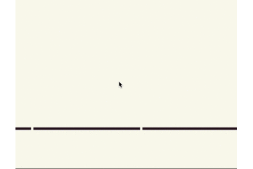
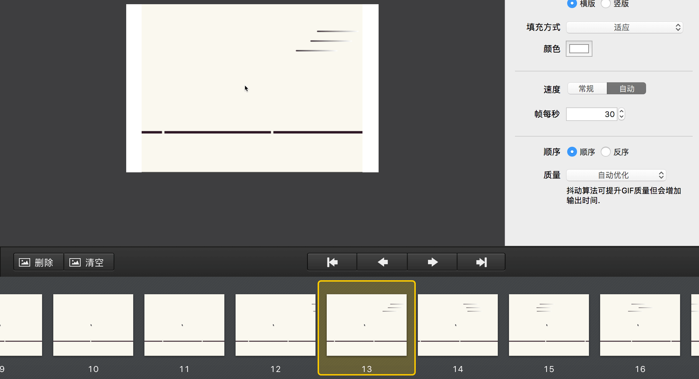

```javascript
  horizon(){
      /**
      * 轮子的底部，也称地平线：
      1.清除画布
      2.画一条直线，且高度6px
      本文@IT·平头哥联盟-首席填坑官∙苏南分享，非商业转载请注明原链接及出处
       */

      this.wheelPos = [];
      this.ctx.save();
      this.ctx.clearRect(0, 0, this.canvasW, this.canvasH);

      let horizonX = 0,horizonY = this.canvasH-100;
      this.ctx.beginPath();
      this.ctx.strokeStyle = this.color;
      this.ctx.lineWidth=6;
      this.ctx.moveTo(horizonX,horizonY);
      this.ctx.lineTo(this.canvasW,horizonY);
      this.ctx.closePath();
      this.ctx.stroke();

      Array.from({length:5}).map((k,v)=>{
          let dotProportion = (this.canvasW*0.49)*v-this.oneCent;
          this.wheelPos.push({x:dotProportion,y:horizonY-this.wheelRadius});
          let startX = dotProportion-(this.animateNum*2); //用于动画滚动移动
          this.ctx.beginPath();
          this.ctx.strokeStyle = "#f9f8ef";
          this.ctx.lineWidth=6;
          this.ctx.moveTo(startX,horizonY);
          this.ctx.lineTo(startX+5,horizonY);
          this.ctx.closePath();
          this.ctx.stroke();
      });
      this.ctx.restore();
      this.shuttle();
      // this.wheel();
  }
  shuttle(){
      /**
      * 画几根横线，有点视差，感觉骑车在飞速穿梭的感觉：
      本文@IT·平头哥联盟-首席填坑官∙苏南分享，非商业转载请注明原链接及出处
       */
      let shuttleX = this.canvasW+100,
              shuttleY = this.canvasH/6;
      let shuttleW = shuttleX+100;
      [0,40,0].map((k,v)=>{
          let random = Math.random()+2;
          let x = shuttleX+k-(this.animateNum*(2.2*random));
          let y = shuttleY+v*24;
          let w = shuttleW+k-(this.animateNum*(2.2*random));
          let grd=this.ctx.createLinearGradient(x,y,w,y);
          grd.addColorStop(0,"#30212c");
          grd.addColorStop(1,"#fff");
          this.ctx.beginPath();
          this.ctx.lineCap="round";
          this.ctx.strokeStyle = grd;
          this.ctx.lineWidth=3;
          this.ctx.moveTo(x,y);
          this.ctx.lineTo(w,y);
          this.ctx.stroke();
          this.ctx.closePath();

      });

  }
```

+ **绘制车轮** ：

  + 接下来我们来画车的两个轮子，轮子的位置在哪里呢？我也是观察了有一会才发现的，其实刚才的地平线，两点的位置，就是车轮的中心点;
  + 所以在刚才绘制点的时候，就记录了5个点的坐标，这样就省去了一次计算，中间有两次是我们需要的
  + **知识点**：`arc`、`fill`


```javascript
  console.log(this.wheelPos);
  this.wheelPos = this.wheelPos.slice(1,3); //这里取1-3
  console.log(this.wheelPos);
  this.wheelPos.map((wheelItem,v)=>{
    let wheelItemX = wheelItem.x, 
    wheelItemY= wheelItem.y-this.wheelBorder/1.5;

    //外胎
    this.ctx.beginPath();
    this.ctx.lineWidth=this.wheelBorder;
    this.ctx.fillStyle = "#f5f5f0";
    this.ctx.strokeStyle = this.color;
    this.ctx.arc(wheelItemX,wheelItemY,this.wheelRadius,0,Math.PI*2,false);
    this.ctx.closePath();
    this.ctx.stroke();
    this.ctx.fill();


    //最后两轮胎中心点圆轴承
    this.axisDot(wheelItemX,wheelItemY);
    this.ctx.restore();
    
  });
  this.ctx.restore();
```

  + 同理，上面画好了两个圆，但车轮肯定有轴承，前后轮我做了些汪样的处理，后轮是实心的加了个填充;
  + 前轮是画了一点断点的圆，用于动画的转动，
  + 在外轮的半径上进行缩小一定比较，画内圈，这里我取了外圈的.94，作为内圆的半径，
  + 还加了两个半圆的描边修饰，让动画跑起来的时候，车轮有动起来的感觉，半圆 Math.PI 就是一个180,(Math.PI * degrees) / 180;  degrees 就是我们想要绘制的起始/结束角度;
  + 从下图可以看出，圆的填充用了 放射性渐变，`createRadialGradient`-创建放射状/环形的渐变（用在画布内容上）

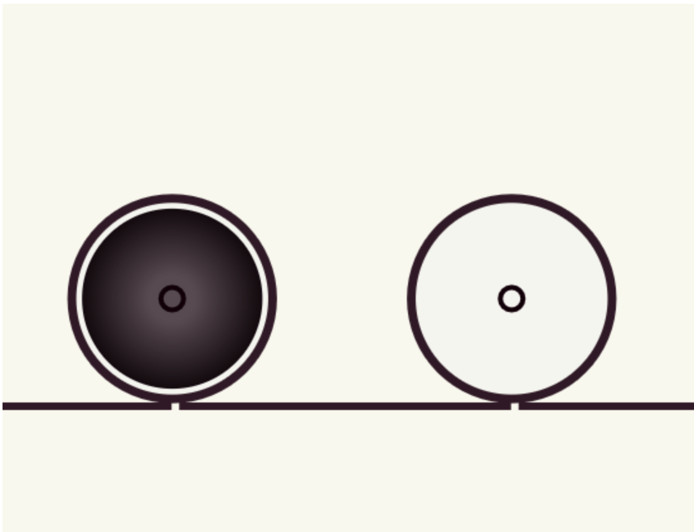
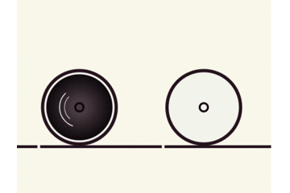


```js
  context.createRadialGradient(x0,y0,r0,x1,y1,r1);
  + createRadialGradient API 说明：
    x0 = 渐变的开始圆的 x 坐标
    y0 = 渐变的开始圆的 y 坐标
    r0 = 开始圆的半径
    x1 = 渐变的结束圆的 x 坐标
    y1 = 渐变的结束圆的 y 坐标
    r1 = 结束圆的半径

    详细使用请看下面代码的实例
```


```javascript

  let scaleMultiple = this.wheelRadius*.94;
  let speed1 = this.animateNum*2; //外圈半圆速度
  let speed2 = this.animateNum*3; //内小圈半圆速度
  //后轮
  if(v === 0){
    
    //内圆
    this.ctx.beginPath();
    let circleGrd=this.ctx.createRadialGradient(wheelItemX,wheelItemY,18,wheelItemX,wheelItemY,scaleMultiple);
      circleGrd.addColorStop(0,"#584a51");
      circleGrd.addColorStop(1,"#11090d");
    this.ctx.fillStyle = circleGrd;
    this.ctx.arc(wheelItemX,wheelItemY,scaleMultiple,0,Math.PI*2,false);
    this.ctx.fill();
    this.ctx.closePath();

    //两个半圆线
    
    [
      {lineW:2,radius:scaleMultiple*.6,sAngle:getRads(-135+speed1) , eAngle:getRads(110+speed1)},
      {lineW:1.2,radius:scaleMultiple*.45,sAngle:getRads(45+speed2) , eAngle:getRads(-50+speed2)}
    ].map((k,v)=>{
      this.ctx.beginPath();
      this.ctx.lineCap="round";
      this.ctx.strokeStyle ="#fff";
      this.ctx.lineWidth=k.lineW;
      this.ctx.arc(wheelItemX,wheelItemY,k.radius,k.sAngle,k.eAngle,true);
      this.ctx.stroke();
      this.ctx.closePath();

    });
    this.ctx.restore();

  }

```

  + ** 拉下来我们就拿前轮开刀** ：
  + 前轮也是画了几个半圆，大概就是以某个角度为起点，然后分别画几个半圆，整体是一个半径，中间有断开，如： eAngle = [0，135，270], sAngle = [-45，0，180];就能画出如下图的圆：

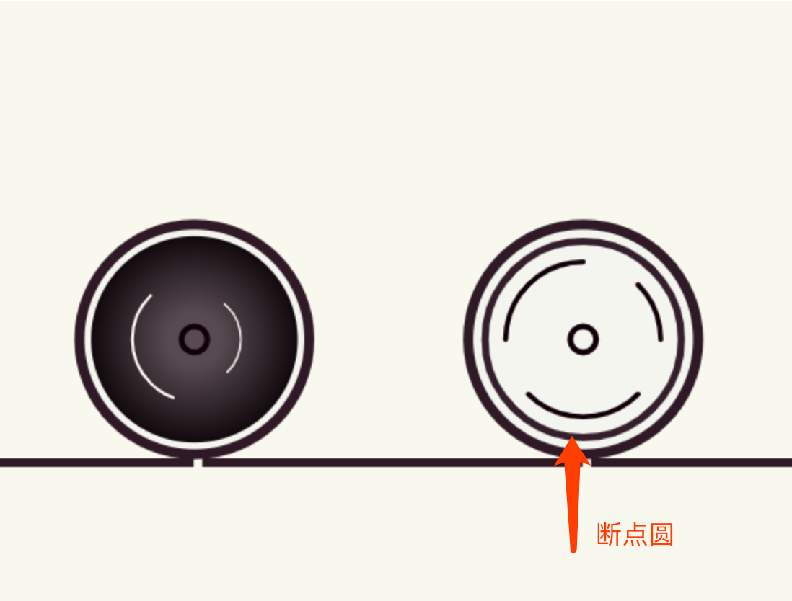
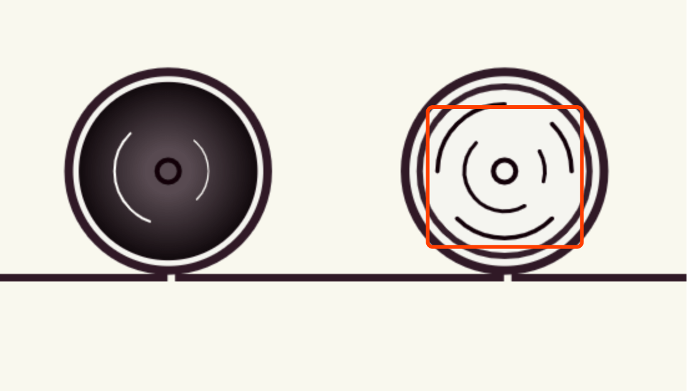

  + ** 具体实现请看下面代码 ** ：

```javascript
  //两个圆，再缩小一圈，画线圆
  Array.from({length:3}).map((k,v)=>{
    let prevIndex = v-1 <= 0 ? 0 : v-1;
    let eAngle = v*135, sAngle = -45+(prevIndex*45)+v*90;
    let radius = scaleMultiple*.75;
    let _color_ = "#120008";
    this.ctx.beginPath();
    this.ctx.lineCap="round";
    this.ctx.strokeStyle = _color_;
    this.ctx.lineWidth=3.5;
    this.ctx.arc(wheelItemX,wheelItemY,radius,getRads(sAngle+speed1),getRads(eAngle+speed1),false);
    this.ctx.stroke();
    this.ctx.closePath();

    if(v<2){
      //再缩小一圈
      let eAngleSmaller = 15+ v*210, sAngleSmaller = -30+v*90;
      let radiusSmaller = scaleMultiple*.45;
      this.ctx.beginPath();
      this.ctx.lineCap="round";
      this.ctx.strokeStyle = _color_;
      this.ctx.lineWidth=3;
      this.ctx.arc(wheelItemX,wheelItemY,radiusSmaller,getRads(sAngleSmaller+speed2),getRads(eAngleSmaller+speed2),false);
      this.ctx.stroke();
      this.ctx.closePath();
    }
    this.ctx.restore();
  });


```

+ **绘制车身车架** ：

  + 车架，应该也是本次分享中较大的难点之一，刚开始我也是这么认为的，但认真冷静、冷静、静静之后分析也还好， 
  + 最开始是用了最笨的办法，`lineTO`、`moveTo`、一根一根线的画，画到一半时发现画两个`三角`或者`一个菱形`即可，然后再把几根主轴重新画一下，于是两种方法都尝试了一下，
    + 先说三角的吧，配合下面画的一个图讲解一下，
    + 找到圆盘的中心点，介于后轮半径之上;
    + 分析车架的结构，我们可以看为是一个菱形，也可以看着是两个三角形，这里以三角为例，菱形可以看 carBracket2方法;
    + 首先算出三角形的起点、再算出三角形的角度、高度，请看下面示图;
    + 最后在后轮的中心点盖上一个圆点 用于遮挡三角的部分
  + 菱形 就要简单些的，但看起来逼格没有这么高端，就是用`lineTo`点对点的划线，
  + 以上就是车架的绘制过程，其实感觉菱形是是要简单、代码量也少些的，有兴趣的同学可以自己尝试一下，大家可以看下面的主要代码，新手上路，如果有更好的方式，欢迎老司机指点：

> **结论** ：使用`moveTo`把画布坐标从`O`移动到`A`点 x/y，`lineTo`从`A`开始画到`B`结束,再从`B`到`C`点，闭合，即一个三角完成

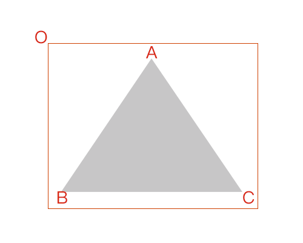


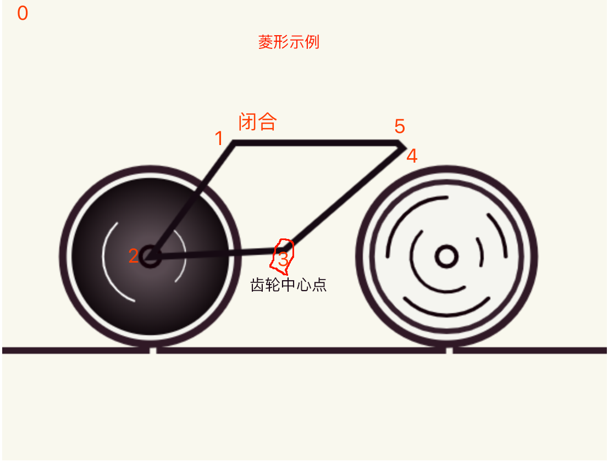


```javascript

//方法二：三角形
  …………此处省略N行代码
  [
  {
    moveX:triangleX1,
    moveY:triangleY1,
    lineX1:coordinateX,
    lineY1:triangleH1,
    lineX2:discX,
    lineY2:discY,
  },
  {
    moveX:triangleX2+15,
    moveY:triangleY2,
    lineX1:triangleX1,
    lineY1:triangleY1,
    lineX2:discX,
    lineY2:triangleH2,
  },
  ].map((k,v)=>{
    this.ctx.beginPath();
    this.ctx.moveTo(k.moveX,k.moveY); //把坐标移动到A点，从A开始
    this.ctx.strokeStyle = this.gearColor;
    this.ctx.lineWidth=coordinateW;
    this.ctx.lineTo(k.lineX1,k.lineY1);//从A开始，画到B点结束
    this.ctx.lineTo(k.lineX2,k.lineY2); //再从B到C点，闭合
    this.ctx.closePath();
    this.ctx.stroke();
    this.ctx.restore();
  });
  ……

//方法一：菱形
  
  …………此处省略N行代码
  this.ctx.beginPath();
  this.ctx.strokeStyle = this.gearColor;
  this.ctx.lineWidth=coordinateW;
  this.ctx.moveTo(polygon1X,polygon1Y);
  this.ctx.lineTo(coordinateX,height);
  this.ctx.lineTo(discX,discY); 
  this.ctx.lineTo(polygon2X,polygon1Y+5);
  this.ctx.lineTo(polygon2X-5,polygon1Y);
  this.ctx.lineTo(polygon1X,polygon1Y);
  this.ctx.closePath();
  this.ctx.stroke();
  ……
```

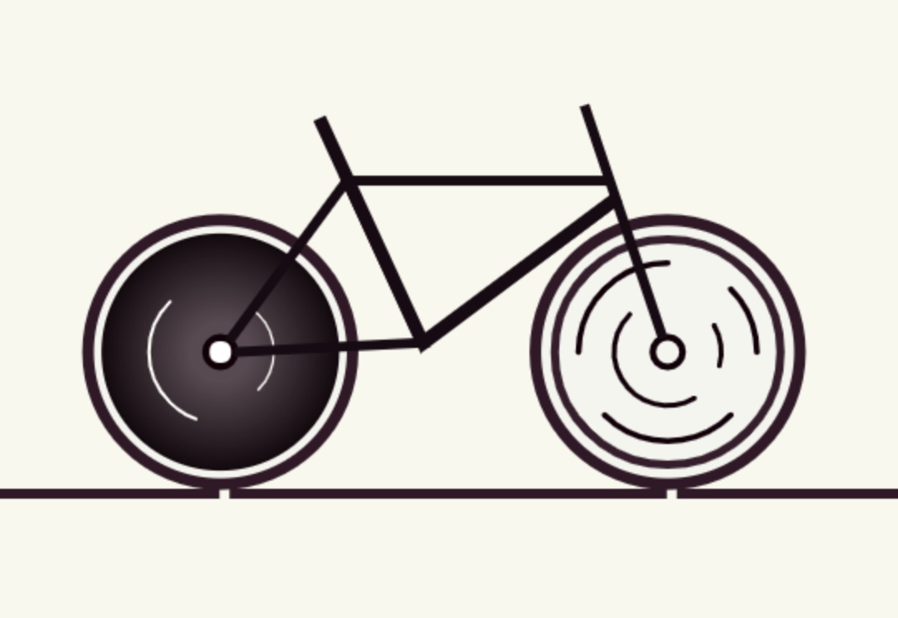

+ **绘制车的豪华宝坐、扶手** ：
  + 坐位一开始是比较懵逼的，不知道如何下手，圆也不圆、方也不方，后面又去复习一下canvas的API，发现了`quadraticCurveTo`能满足这个需求，—— **二次贝塞尔曲线**
  + 画完之后，思考了很久，也没有发现什么技巧，或者规律，可能数学学的不好，没办法只能这样慢慢描了
  + 扶手也是一样的，开始尝试`quadraticCurveTo`，半天也没画成功，后面尝试去找了它邻居`bezierCurveTo`，—— **三次贝塞尔曲线**
  + **提示**：三次贝塞尔曲线需要三个点。前两个点是用于三次贝塞尔计算中的控制点，第三个点是曲线的结束点。曲线的开始点是当前路径中最后一个点
  + **知识点**：`quadraticCurveTo`、`bezierCurveTo`、`createLinearGradient`

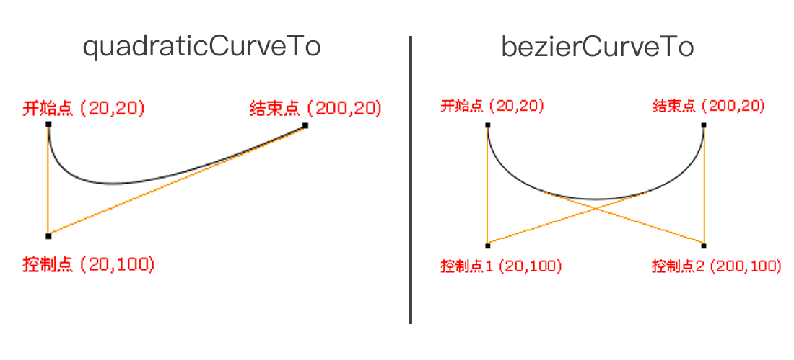
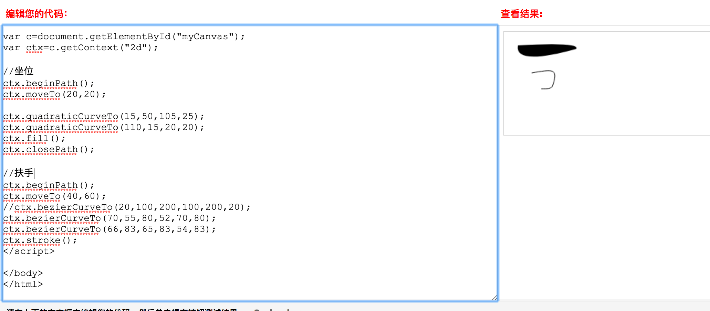
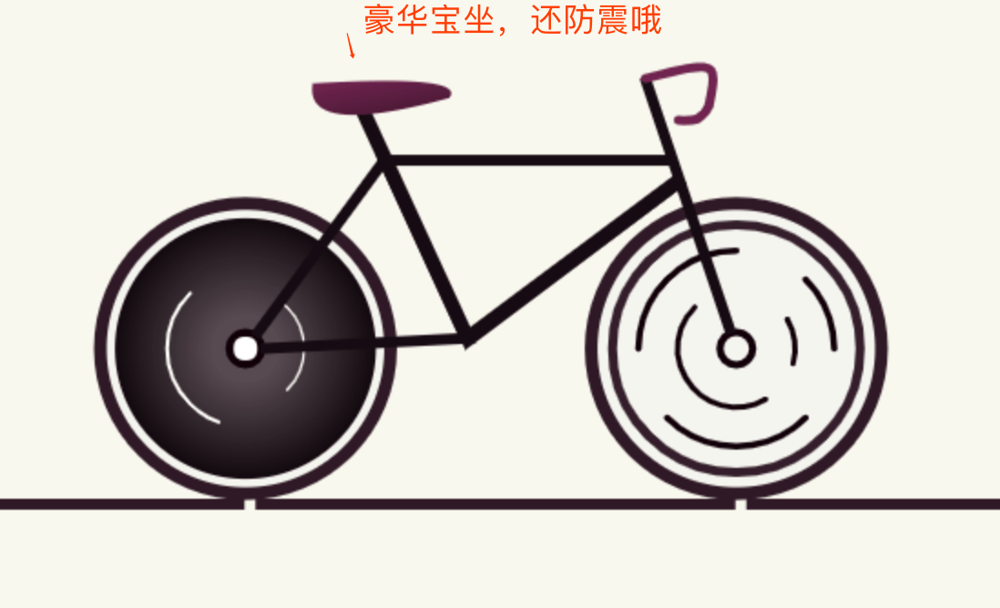

```js
  //坐位
  this.ctx.restore();
  let seatX = (discX-85),seatY=discY-140;
  let curve1Cpx = [seatX-5,seatY+30,seatX+75,seatY+8];
  let curve2Cpx =[seatX+85,seatY-5,seatX,seatY]; 
  this.ctx.beginPath();
  // this.ctx.fillStyle = this.gearColor;
  let grd=this.ctx.createLinearGradient(seatX,seatY,seatX+10,seatY+60); //渐变的角度 
  grd.addColorStop(0,"#712450");
  grd.addColorStop(1,"#11090d");
  this.ctx.fillStyle = grd;
  this.ctx.moveTo(seatX,seatY);
  this.ctx.quadraticCurveTo(...curve1Cpx);
  this.ctx.quadraticCurveTo(...curve2Cpx);
  this.ctx.fill();

  //车前轴上的手柄
  let steeringX = lever1X-20,steeringY = lever1Y-45;
  let steeringStep1 = [steeringX+40,steeringY-10,steeringX+40,steeringY-10,steeringX+35,steeringY+15]
  let steeringStep2 = [steeringX+30,steeringY+25,steeringX+25,steeringY+23,steeringX+18,steeringY+23]
  this.ctx.beginPath();
  this.ctx.lineCap="round";
  this.ctx.strokeStyle = "#712450";
  this.ctx.lineWidth=coordinateW;
  this.ctx.moveTo(steeringX,steeringY); //40 60;
  this.ctx.bezierCurveTo(...steeringStep1);
  this.ctx.bezierCurveTo(...steeringStep2);
  this.ctx.stroke();
  this.ctx.closePath();

```

+ **绘制车的发动机、脚踏板** ：
  + 到了这里，也快接近本文的尾声了，接下来要讲的是是车辆中最重要的部分，车中间齿轮盘，一辆车没有它，你做的再好也是白搭了;
  + 前面多次讲到齿轮的中心点，包括两个三角都是以它的中心计算的三角角度，知道了位置那就容易了，一样的先画几个圆，每个按一定的比例缩小;
  + 然后外围再画一圈锯齿，这样齿轮大概就画好了，齿轮的技巧在于以圆盘为中心点，画一圈线，它跟[时钟的刻度](https://segmentfault.com/blog/honeybadger "@IT·平头哥联盟-首席填坑官")原理是一样的;
  + 脚踏板，这个好理解，就是用`lineTo`画两跟线，其中一根进行一个90度的旋转就ok了，但重点是它在动画过程中的一个过程呢，我的分析过程是这样：
    + 竖着的这根轴是，以圆盘齿轮的中点为基点 `N* (Math.PI / 180)`转动;
    + 横着的这根轴，也就是脚踏板，它是以竖着的轴底部为Y轴中心点，以自身宽度的二分之一为X轴为中心点，同样以 `N* (Math.PI / 180)`的 `rotate`角度旋转。
  + 说了这么多，我们来看几张[动态图](https://juejin.im/user/597de6e0f265da3e3c5f6d7d/posts "@IT·平头哥联盟-首席填坑官")吧，顺便贴上代码：

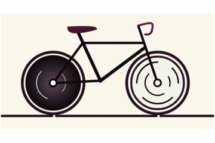

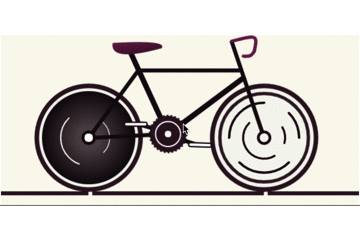

```javascript

  discGear(coordinateX,coordinateY,coordinateW){
    //车中间齿轮盘 disc
    let discX = coordinateX,discY = coordinateY;
    let discRadius = this.wheelRadius*.36;//车轮的3.6;

    let discDotX = discX+discRadius+8,discDotY = discRadius/.98;
    this.ctx.restore();
    this.ctx.save();
    this.ctx.translate(discX,discY);
    // this.ctx.rotate(-(Math.PI/2));

    Array.from({length:30}).map((v,index)=>{
      let radian = (Math.PI / 15) ;
      this.ctx.beginPath();
      this.ctx.lineCap="round";
      this.ctx.strokeStyle = this.color;
      this.ctx.rotate(radian);
      this.ctx.lineWidth=3;
      this.ctx.moveTo(0,discDotY);
      this.ctx.lineTo(1.5,discDotY);
      // ctx.arc(discDotX,discDotY,6,0,Math.PI*2,false);
      this.ctx.closePath();
      this.ctx.stroke();

    });
    this.pedal(discX,discY,discRadius);
    this.pedal(discX,discY,discRadius,1);
    
    this.ctx.restore();
  }
  pedal(coordinateX,coordinateY,discRadius,turnAngle=0){

    //脚踏板，分两次初始化，一次在中心齿轮绘制之前，一次在之后，

    let pedalX = coordinateX, pedalY = coordinateY - discRadius*.7;
    let pedalW = 6,
        pedalH =  discRadius*1.9;
    let radian = (this.animateNum)*(Math.PI / 180) ;
    let radianHor = (this.animateNum)*(Math.PI / 180) ;
    let turnAngleNum = 1;
    let moveY = 28;
    if(turnAngle !== 0){
      this.ctx.rotate(-180*(Math.PI/180));
      turnAngleNum = (Math.PI/180);
    };
    this.ctx.beginPath();
    this.ctx.rotate(radian*turnAngleNum);
    this.ctx.lineCap="round";
    this.ctx.strokeStyle = this.gearColor;
    this.ctx.lineWidth=pedalW;
    this.ctx.moveTo(-1,moveY);
    this.ctx.lineTo(0,pedalH);
    this.ctx.closePath();
    this.ctx.stroke();
    
    this.ctx.save();
    let pedalHorW = pedalH/1.5,pedalHorH=pedalW;
    this.ctx.translate(0,pedalH);
    this.ctx.beginPath();
    this.ctx.rotate(-radianHor);

    this.ctx.lineCap="round";
    this.ctx.fillStyle = "#fff";
    this.ctx.strokeStyle = this.gearColor;
    this.ctx.lineWidth =2;
    this.ctx.roundRect(-pedalHorW/2,-2,pedalHorW,pedalHorH,5);
    this.ctx.closePath();
    this.ctx.fill();
    this.ctx.stroke();

    this.ctx.restore();
  }

```

+ **绘制车的链条** ：
  + 链条用的是 `bezierCurveTo` ，cp1x,cp1y,cp2x,cp2y,x,y等参数画出来的，具体看下面代码吧，其实就是两个半椭圆的拼接……

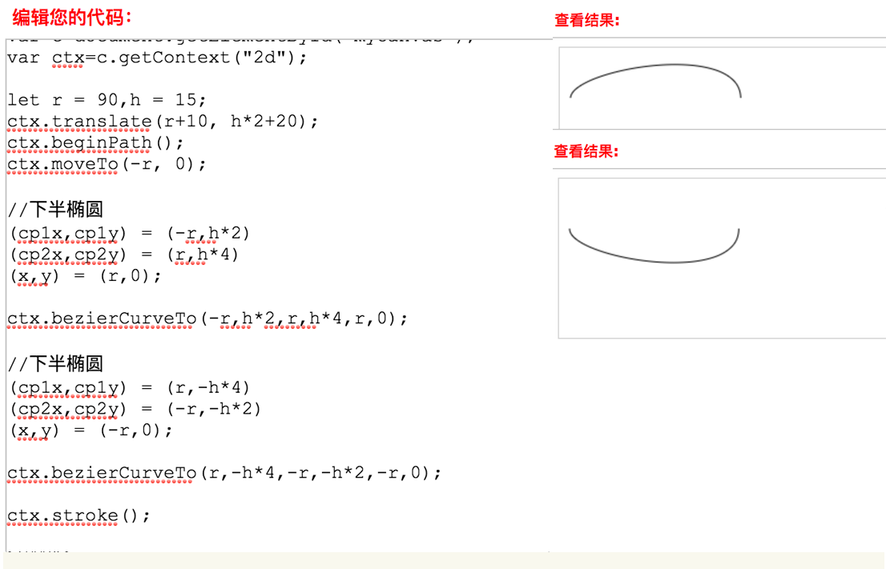

```javascript
  //链条

  let chainW = ( coordinateX+discRadius - this.wheelPos[0].x) / 2;
  let chainX = this.wheelPos[0].x +chainW-5 ;
  let chainY = coordinateY;
  this.ctx.save();
  this.ctx.translate(chainX,chainY+4.8);
  this.ctx.rotate(-2*(Math.PI/180));
  let r = chainW+chainW*.06,h = discRadius/2;
  this.ctx.beginPath();
  this.ctx.moveTo(-r, -1);
  this.ctx.lineWidth=3;
  this.ctx.strokeStyle = "#1e0c1a";
  this.ctx.bezierCurveTo(-r,h*1.5,r,h*4,r,0);
  this.ctx.bezierCurveTo(r,-h*4,-r,-h*1.5,-r,0);
  this.ctx.closePath();
  this.ctx.stroke();
  this.ctx.restore();

```

## 尾声

　　以上就是今天[@IT·平头哥联盟](https://honeybadger8.github.io/blog/ "@IT·平头哥联盟")-`首席填坑官`∙[苏南](https://github.com/meibin08 "首席填坑官")给你带来的分享，整个车的绘制过程，感觉车架部分应该还有更好的做法，如果您有更好的建议及想法，欢迎斧正，最后送上完整的示例图！
　　[文章源码获取-> blog-resource 👈](https://github.com/honeybadger8/ "@IT·平头哥联盟")
　　[想直接在线预览 👈](https://codepen.io/meibin08/pen/xyXmNq "@IT·平头哥联盟-首席填坑官∙苏南分享")


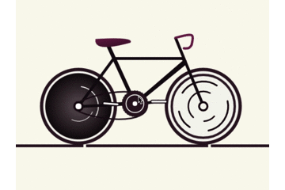


> 作者：苏南 - [首席填坑官](https://github.com/meibin08/ "首席填坑官")
>
> 来源：[@IT·平头哥联盟](https://honeybadger8.github.io/blog/ "@IT·平头哥联盟")
> 
> 链接：https://honeybadger8.github.io/blog/
> 
> 交流群：912594095[`资源获取/交流群`]、386485473(前端) 、260282062(测试)
>
> 本文原创，著作权归作者所有。商业转载请联系`@IT·平头哥联盟`获得授权，非商业转载请注明原链接及出处。

工作中积累的经验、填过的坑，希望能尽绵薄之力 助其他同学少走一些弯路")


