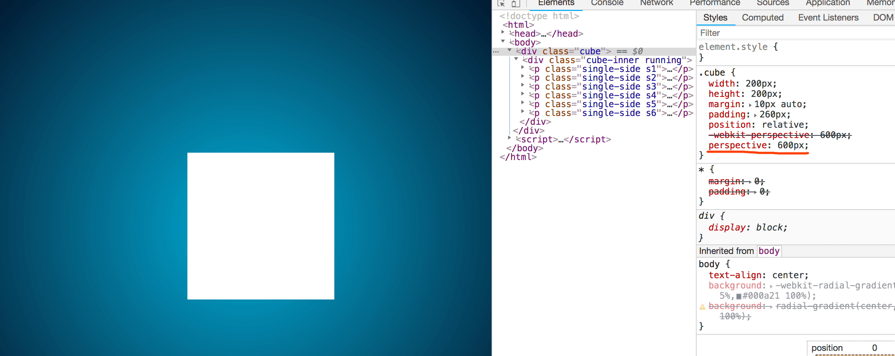
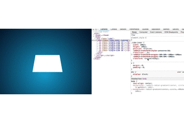
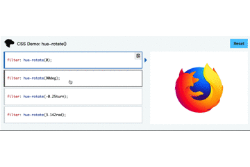
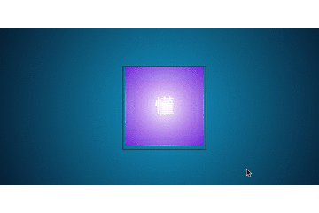
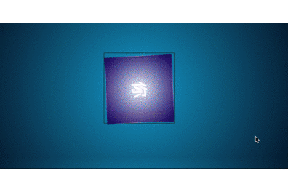
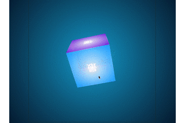

# 每周动画一点点——CSS3画出懂你的3D魔方


> 作者：[首席填坑官∙苏南](https://github.com/meibin08/ "首席填坑官∙苏南")
>
> 来源：[@IT·平头哥联盟](https://honeybadger8.github.io/blog/ "@IT·平头哥联盟")
>
> 交流群：[912594095](https://shang.qq.com/wpa/qunwpa?idkey=265166274bca82709718a0ae1fa9c55d65dd3608ebc780f9e6ea41e2761f5ec2 "@IT·平头哥联盟QQ交流群")，本文原创，著作权归作者所有，转载请注明原链接及出处。

## 前言

　　最近在写《[每周动画点点系列](./animation-sequence.md "每周动画点点系列")》文章，上一期分享了[< 手把手教你如何绘制一辆会跑车 >](./canvas-bike.md "每周动画点点系列之手把手教你如何绘制一辆会跑车")，本期给大家带来是结合CSS3画出来的一个`立体3d魔方`，结合了`js`让你随心所欲想怎么转，就怎么转，这里是 [@IT·平头哥联盟](https://honeybadger8.github.io/blog/ "@IT·平头哥联盟")，我是`首席填坑官`∙[苏南](https://github.com/meibin08 "首席填坑官")(South·Su)，我们先来看看效果，然后再分解它的实现过程吧

　　

## 绘制过程：
　　好吧，gif图看着好像有点不是很清晰，想在线预览的同学，可直达页面底部，点击`在线预览`，废话不多扯了，先来分析一下，看如何实现这个功能吧。

##### ∙ API预热 ：
 + 本次示例是一个立体的正方形，既然有立体效果，肯定少不了CSS3中的 `-webkit-perspective`-透视、`preserve-3d`-三维空间，这个两个是重点哦，当然还有`transform-origin`、`transition`、`transform`等，先来回故一下 **API** 怎么是讲的吧：

> perspective **取值** : 
> + **none** ：不指定透视 ;
> + **length** ：指定观察者与「z=0」平面的距离，使具有三维位置变换的元素产生`透视效果`。「z>0」的三维元素比正常大，而「z<0」时则比正常小，大小程度由该属性的值决定，不允许负值。
> 
> transform-style **取值** ：
> + **flat** ：指定子元素位于此元素所在平面内;
> + **preserve-3d** ：指定子元素定位在三维空间内,当该属性值为 `preserve-3`d时，元素将会创建局部堆叠上下文;
> + 
> **小结** ：决定一个变换元素看起来是处在三维空间还是平面内，需要该元素的父元素上定义 <' transform-style '> 属性，也就是说想某元素有三维效果，需要设定它的父级有 `preserve-3d `。
> 
> transform-origin **取值** ：
> + percentage：用百分比指定坐标值。可以为负值;
> + length：用长度值指定坐标值。可以为负值;
> + left：指定原点的横坐标为left;
> + center①：指定原点的横坐标为center;
> + right：指定原点的横坐标为right;
> + top：指定原点的纵坐标为top;
> + center②：指定原点的纵坐标为center;
> + bottom：指定原点的纵坐标为bottom;
> + 
> transform、transition等，就不介绍了


``` css
/* perspective 使用示例：*/
div{
	-webkit-perspective:600px;
	perspective:600px;
}

/*transform-style 使用示例：*/
.preserve{
	transform-style:preserve-3d;
	-webkit-transform-style:preserve-3d;
}

  /*transform-origin 使用示例：*/
.preserve{
	-webkit-transform-origin:50% 50% -100px; or 
	-webkit-transform-origin:bottom; or
	-webkit-transform-origin:top;
	…………
}
  

```

##### ∙ 绘制6个面 ：
 + 是的，我没有说错，就是6个面：上、正面、下、背面、左、右，
 + 上面API讲了这么多，来实践试一下吧，写6个div,结构大概是这样的，也是接下来的魔方需要的结构：

```html

<div class="cube">
    <div class="cube-inner running">
        <p class="single-side s1"><span>最</span></p>
        <p class="single-side s2"><span>懂</span></p>
        <p class="single-side s3"><span>你</span></p>
        <p class="single-side s4"><span>的</span></p>
        <p class="single-side s5"><span>魔</span></p>
        <p class="single-side s6"><span>方</span></p>
    </div>
</div>

```




 + ！！！发生了什么？？是不是很吃惊？？说好的值越大，透视效果越强的呢？后面明明藏了个妹子，怎么看没有透视出来？
 + 开始我也是跟你一样吃惊的，但瞬间就悟透了，少了`rotate`,加个它再来看看效果吧：



```css

.cube{
    width:200px;
    height:200px;
    margin:10px auto;
    padding:260px;
    position:relative;
    -webkit-perspective:600px;
    perspective:600px;
    transition: .5s ;

}
.cube-inner{
    width:200px;
    height:200px;
    position:relative;
    -webkit-transform-style:preserve-3d;
    transition:.3s; 
    -webkit-transform-origin:50% 50% -100px;
    transform: rotateX(45deg);
}
.cube:hover{
    /*鼠标经过时，把 perspective 过渡到100 */
    -webkit-perspective:100px;
    perspective:100px;
}

```

+ 既然API有效，那么拉下来我们就画出6个面吧，按：上、正面、下、背面、左、右，这个顺序来设置吧;
+ 首先，我们要指定它们是在三维空间内的`preserve-3d`，也就是6个面的父级要设置 `transform-style` 样式;
+ 以上都设置好后，再来看看6个面吧，为了便于区分，给它们每个都设置了不同颜色(用了css3的渐变 `radial-gradient`)——不想手写的同学[推荐一个网站](http://www.colorzilla.com/gradient-editor/ "可视化渐变设置")可在线设置你要的效果，复制样式即可，先来一睹风采,为了便于观察，整体角度旋转了10deg：


+ 说到渐变，偶然之间发现了一个有意思的东西`hue-rotate`，它能在你初始的颜色基础上旋转元素的色调及其内容，从而达到不同的效果。[了解更多](https://developer.mozilla.org/en-US/docs/Web/CSS/filter-function/hue-rotate)

!> **hue-rotate** : The hue-rotate() CSS function rotates the hue of an element and its contents. Its result is a <filter-function>.



+ ** 上 **  - "`最`"：

```css
.cube-inner .single-side.s1{
    /*s1顶部*/
    left:0;top:-200px;
    background: radial-gradient(circle, rgba(255,255,255,.88), #00adff);
    background: -webkit-radial-gradient(circle, rgba(255,255,255,.88), #00adff);
    transform-origin:bottom;
    -webkit-transform-origin:bottom;
    transform:rotateX(90deg);
    -webkit-transform:rotateX(90deg);
}
```


+ ** 正面 **  - "`懂`"：
  + 下面就是默认的，什么都不用设置，所以就不展示了 ;

+ ** 下面 ** - "`你`"：
  + 即底部，底部的设置，正好跟顶部它是相反的，一个origin 以 bottom为基准为坐标，一个以top为基准为坐标;

```css
.cube-inner .single-side.s3{
    /*s3底部*/
    left:0;top:200px;
    background: radial-gradient(circle, rgba(255,255,255,.88), #100067);
    background: -webkit-radial-gradient(circle, rgba(255,255,255,.88), #100067);
    transform-origin:top;
    -webkit-transform-origin:top;
    transform:rotateX(-90deg);
    -webkit-transform:rotateX(-90deg);
}
```


+ ** 背面 ** - "`的`"：
  + 即正面的后边，整体旋转了 135deg，让背面更直观能看到;
  + translateZ 、rotateX 同时移动，形成透视的关系，让它看起来，在正面面的后面;
  + 下图二，把默认的正面，设置了透明度，可以看出，背面的透视效果;

```css
.cube-inner .single-side.s4{
    /*s4背部*/
    z-index:2;
    left:0;top:0;
    background: radial-gradient(circle, rgba(255,255,255,.88), #F0C);
    background: -webkit-radial-gradient(circle, rgba(255,255,255,.88), #F0C);
    transform:translateZ(-200px) rotateX(180deg) ; 
    -webkit-transform:translateZ(-200px) rotateX(180deg) ; /*rotateZ(-180deg) 左右旋转的时候，Z轴旋转180°，因为字是倒着的*/
}
```


+ ** 左侧面 ** - "`魔`"：
  + origin以right为基准，left负元素的宽度，rotateY轴旋转90deg;

```css
.cube-inner .single-side.s5{
    /*s5左侧*/
    left:-200px;top:0;
    background: radial-gradient(circle, rgba(255,255,255,.88),rgba(33,33,33,1));
    background: -webkit-radial-gradient(circle, rgba(255,255,255,.88),rgba(33,33,33,1));
    transform-origin:right;
    -webkit-transform-origin:right;
    transform:rotateY(-90deg)
    -webkit-transform:rotateY(-90deg)
}
```


+ ** 右侧面 ** - "`方`"：
  + 同理右侧，与左侧正好相反;

```css
.cube-inner .single-side.s6{
    /*s6右侧*/
    right:-200px;top:0;
    transform-origin:left;
    -webkit-transform-origin:left;
    background: radial-gradient(circle, rgba(255,255,255,.88), #f00);
    background: -webkit-radial-gradient(circle, rgba(255,255,255,.88), #f00);
    transform:rotateY(90deg);
    -webkit-transform:rotateY(90deg);
}
```


> **小结** ： 嗯,以上魔方的6个面的绘制过程，基本已经完成，主要在在于`transform-origin`、`rotate`、`translate`等属性的应用，但为了让它更炫酷一些，我们还要给边角加一些光感。

##### ∙ 添加高光 ：

 + 细心的宝宝，前面的布局应该已经发现了，每一行布局的`p`标签里，都多套了一层`span`，就是为高光光感，埋下的伏笔，一个平面正方形有四个边，after、before只有两，那么肯定要再套一层，当然方法很多，比如直接用border也是可以的，但比较麻烦，我就选择了现在要讲的这种：
 + after、before设置1px的边框，设置一个线性渐变，中间是白色，两断是过渡到透明的，这样高光就有了，来看一组图吧：




##### ∙ CSS 360°旋转 ：
+ 上面是一个鼠标经过的过渡动画，可以看出立体效果是已经有了，接下来就写一个CSS `animation`的动画，让它360度旋转，每个角都能看到，这样会显的很666;
+ animation 配合 `keyframes` 使用，请看代码示例：


```css
.cube .cube-inner{ 
	/*-webkit-transform:rotateX(180deg) rotateY(0deg) ;*/
	animation: elfCube 10s infinite ease-in-out;
	-webkit-animation: elfCube 10s infinite ease alternate;
}

@keyframes elfCube {
	0% { 
		transform: rotateX(0deg) rotateY(0deg); 
	}
	50% { 
		transform: rotateX(360deg) rotateY(360deg); 
	}
	100% { 
		transform: rotateX(0deg) rotateY(0deg); 
	}
}
@-webkit-keyframes elfCube {
	0% {
	 -webkit-transform: rotateX(0deg) rotateY(0deg); 
	}
	50% {
	 -webkit-transform: rotateX(360deg) rotateY(360deg); 
	}
	100% { 
		transform: rotateX(0deg) rotateY(0deg); 
	}
}
```




##### ∙ 跟随鼠标旋转 ：
+ 说好的随着鼠标旋转呢？？
+ 别慌，接下来就是带你装逼，带你飞的时候，
  + 首先我们要了解，鼠标在容器内所在的位置，X = e.pageX - ele.offsetLeft, Y = e.pageY - ele.offsetTop;
  + 同时要知道元素内的中心点：centerX = width/2,centerY =height/2;
  + 然后得出值：axisX = X - centerX，axisY = Y - centerY;
  + **PS** ： 开始尝试想的是鼠标从哪个方向进入，得到它的角度，但发现旋转效果不明显 ，有兴趣的同学可以尝试一下：(((Math.atan2(Y, X) * (180 / Math.PI)) + 180) / 90)，参考司徒大神的[JS判断鼠标从什么方向进入一个容器](https://www.cnblogs.com/rubylouvre/archive/2012/11/06/2757175.html);
  + 最后，给容器绑上事件：`mouseover`、`mousemove`、`mouseout`，鼠标进入时，暂停css的动画，不然会相互打架哦！



```js
 ……
getAxisX(e){
	let left = this.cubeEle.offsetLeft;
	return e.pageX - left - (this.cubeW/2) * (this.cubeW>this.cubeH ? this.cubeH/this.cubeW : 1);
}
getAxisY(e){
	let top = this.cubeEle.offsetTop;
	return e.pageY - top - (this.cubeH/2) * (this.cubeH>this.cubeW ? this.cubeW/this.cubeH : 1);
}
 …………

```


```js
 …………
run(){
	this.cubeEle.addEventListener('mouseover',(e)=>this.hoverOut(e),false);
	this.cubeEle.addEventListener('mousemove',(e)=>this.move(e),false);
	this.cubeEle.addEventListener('mouseout',(e)=>this.hoverOut(e),false);
}
hoverOut(e){
	//进入/离开
	e.preventDefault();
	this.axisX = this.getAxisX(e),
	this.axisY = this.getAxisY(e);

	if(e.type == 'mouseout'){ //离开
		this.axisX=0;
		this.axisY = 0;
		console.log("离开")
		this.cubeInner.className="cube-inner running";
	}else{
		this.cubeInner.className="cube-inner";
		console.log("进入")
	};
	let rotate = `rotateX(${-this.axisY}deg) rotateY(${-this.axisX}deg)`;
	this.cubeInner.style.WebkitTransform = this.cubeInner.style.transform = rotate;
}
 ……
```

## 结尾：
 + -webkit-perspective，
 + -webkit-transform-style，
 + -webkit-transform-origin，
 + radial-gradient、linear-gradient，
 + transform：rotate、translate、scale，
 + transition，
 + animation;
 + 以上就是今天为大家带来的分享，以及使用到的API，如文章中有不对之处，烦请各位大神斧正，
 + [文章源码获取-> blog-resource 👈](https://github.com/honeybadger8/blog-resource "@IT·平头哥联盟")
 + [想直接在线预览 👈](https://codepen.io/meibin08/pen/MPXZXp "@IT·平头哥联盟-首席填坑官∙苏南分享")


> 作者：苏南 - [首席填坑官](https://github.com/meibin08/ "首席填坑官")
>
> 来源：[@IT·平头哥联盟](https://honeybadger8.github.io/blog/ "@IT·平头哥联盟")
> 
> 链接：https://honeybadger8.github.io/blog/
> 
> 交流群：912594095[`资源获取/交流群`]、386485473(前端) 、260282062(测试)
>
> 本文原创，著作权归作者所有。商业转载请联系`@IT·平头哥联盟`获得授权，非商业转载请注明原链接及出处。


