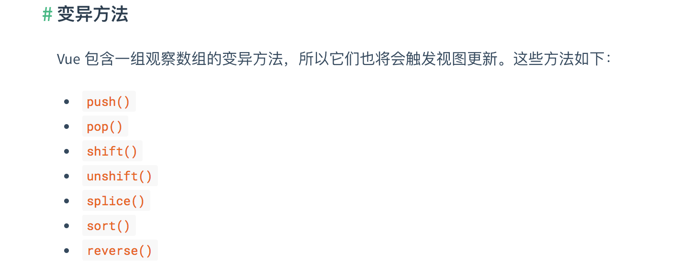

# 初学者可能不知道的vue技巧


> 作者：[首席甩锅官∙老金](https://github.com/hejinze789/ "首席甩锅官∙老金")<br/>
> 来源：[@IT·平头哥联盟](https://honeybadger8.github.io/blog/ "@IT·平头哥联盟")<br/>
> 交流群：[912594095](https://shang.qq.com/wpa/qunwpa?idkey=265166274bca82709718a0ae1fa9c55d65dd3608ebc780f9e6ea41e2761f5ec2 "@IT·平头哥联盟QQ交流群")，本文原创，著作权归作者所有，转载请注明原链接及出处。

## 前言

　　大家好，这里是[@IT·平头哥联盟](https://honeybadger8.github.io/blog/ "@IT·平头哥联盟")，我是`首席甩锅官`——[老金](https://github.com/hejinze789)，今天给大家分享的，一些日常中神秘而又简单的vue的实用小技巧，以及我在我司项目中实用vue的总结和坑，跟大家一起分享，希望能给其他攻城狮带来些许便利，如有理解错误，请纠正。

## 技巧/坑点

### 1.setTimeout/ setInterval 

+ **场景一** ：this指向改变无法用this访问vue实例

```js
  mounted(){
    setTimeout( function () {
    //setInterval同理
    console.log(this); //此时this指向Window对象
    }，1000) ;
  }
```

  + **解决方法** :使用箭头函数或者缓存this

```js
  //箭头函数访问this实例因为箭头函数本身没有绑定this
  setTimeout(() => {
    console. log(this);},  500) ;
    //使用变量访问this实例let self=this;
  },1000);
  setTimeout (function () {
    console. log(self);//使用self变量访问this实例
  }, 1000) ;

```

##### setInterval路由跳转继续运行并没有销毁

+ **场景一** :比如一些弹幕，走马灯文字，这类需要定时调用的，路由跳转之后，因为组件已经销毁了，但是setlnterval还没有销毁，还在继续后台调用，控制台会不断报错，如果运算量大的话，无法及时清除，会导致严重的页面卡顿。

  + **解决方法** :在组件生命周期beforeDestroy停止setInterval

```js
 
  created() {
       this.intervalid = setInterval(() => {
          this.layerError = "";
          this.Timer = null;
      }, 100000);
   }
  beforeDestroy( ){
    //我通常是把setInterval( )定时器赋值给this实例，然后就可以像下面这么暂停。
    clearInterval(this.intervalid);
  }
```

#### 2.Vue路由拦截浏览器后退实现草稿保存类似需求

+ **场景一** :为了防止用户突然离开，没有保存已输入的信息。

  + **解决方法** :

```js

  //在路由组件中:mounted(){}，
  beforeRouteLeave (to, from, next) {
      if(用户已经输入信息){
        //出现弹窗提醒保存草稿，或者自动后台为其保存
      }else{
        next(true);//用户离开
      }
  }

```

#### 3.自定义组件添加click等事件不生效

+ **场景一** :一些自定义组件，需要额外添加一些事件来实现一些特定需求

```html
  <template>
    <el-progress type="circle" :percentage=“0" @click=“stopProgress”></elprogress>
  </template>
  <script>
    export default {
       methods:{
            stopProgress() { 
            console.log('停止')
            }
        }
    }
  </script>
```

  + **解决方法**:使用.native修饰符

```html
  <template>
    <el-progress type="circle" :percentage=“0" @click.native=“stopProgress”></el-progress>
  </template>
  <script>
    export default {
        methods:{
            stopProgress() { 
            console.log('停止')
            }
        }
    }
  </script>
```

#### 4.手动操控自定义组件

+ **场景一** :一些自定义组件，需要去获取组件对象进行一些其他的Dom操作

  + **解决方法** :使用ref属性暴露组件获取句柄

```html

  <template>
    <el-progress type="circle" :percentage="O" ref="progress"></el-progress></template>
  <script>
    this.$refs.progress //组件对象实例， 可以手动调用组件的内置方法和属性
    this.$refs.progress.$el //组件 对象的最外层dom元素
  </script>

```

#### 5.深度作用选择器

+ **场景一** : scoped的样式，希望影响到子组件的默认样式

在样式中设置完scoped在浏览器解析为如下图这样，a是个div，a div里面包含一个组件里面解析完了div的样式名字为b，想在父组件影响到子组件的默认样式。


解决方法:

```html

  <style scoped>
    .a >>> .b { /* ... */ }
  </style>
    //有些像Sass之类的预处理器无法正确解析>>>。这种情况下你可以使用/deep/操作符取而代之- - - -这是一个>>>的别名，同样可以正常工作。
  <style scoped lang=“scss”>
    .a /deep/ .b { /* ... */ }
  </style>
```

#### 6.Vue数组/对象更新视图不更新

+ **场景一** :很多时候我们习惯于这样操作数组和对象

```javascript

  data() { 
    return {
        arr: [1,2,3],
        obj:{
          a: 1,
          b: 2 
        }
    }; 
  },

  // 数组更新视图不更新
  this.arr[0] = 'OBKoro1';
  this.arr.length = 1;
  console.log(arr);// ['OBKoro1']; 
  // 数据更新，对象视图不更新	 
  this.obj.c = 'OBKoro1';
  delete this.obj.a;
  console.log(obj);  // {b:2,c:'OBKoro1'}
 
```

  + **解决方法** ：

    + this. $set(你要改变的数组/对象，你要改变的位置/key,你要改成什么value)
    + 数组原生方法触发视图更新（ [vue官网可查](https://cn.vuejs.org/v2/guide/list.html#%E5%8F%98%E5%BC%82%E6%96%B9%E6%B3%95)）:
    + 整体替换数组/对象

  


#### 7.Vue Filters过滤器的使用

+ **场景一** :常见的数据文本的格式化

```javascript
  <!-- 在双花括号中 -->
  <div>{{ message | DateFormat }}</div>	//展示正确时间
  <!-- 在'v-bind'中 -->
  <div v-bind:id="rawId | formatId"></div>

  Demo:一个日期过滤器返回yyyy- MM-ddhh:mm:ss的样式
  引入一个提前写好日期格式化的js
  import dayjs from ‘dayjs';
  export default {
     data() {
        return {
        		//时间毫秒
				message:18324798324789 
			}
    },
    filters: {
  		//传入进行日期格式化
      DateFormat(value) {
        return dayjs(value).format(“YYYY-MM-DD HH:mm:ss")
  		} 
    }
  }
```

#### 8.Vue深度watch与watch立即触发回调

+ **场景一** :在watch里面监测对象里面对应的值是监测不到的，可以用如下方法。
  + 选项: deep
  + 在选项参数中指定deep:true,可以监听对象中子属性的变化。

  + 选项: immediate
  + 在选项参数中指定immediate:true,将立即以表达式的当前值触发回调，也就是默认触发一次。

```javascript
  watch: {
    obj: {
        handler(val, oldVal) {
          console.log('属性变化触发这个回调',val, oldVal); 
        },
        deep: true // 监测这个对象中每一个属性的变化
    },
    step: { // 属性 //watch
       handler(val, oldVal) {
        console.log("默认触发一次", val, oldVal); 
       },
       immediate: true // 默认触发一次
    }
  }
```

欢迎大家一起探讨 ～～

> 作者：老金 - [首席甩锅官](https://github.com/hejinze789)
>
> 来源：[@IT·平头哥联盟](https://honeybadger8.github.io/blog/ "@IT·平头哥联盟")
> 
> 链接：https://honeybadger8.github.io/blog/
> 
> 交流群：912594095[`资源获取/交流群`]、386485473(前端) 、260282062(测试)
>
> 本文原创，著作权归作者所有。商业转载请联系`@IT·平头哥联盟`获得授权，非商业转载请注明链接及出处。 
